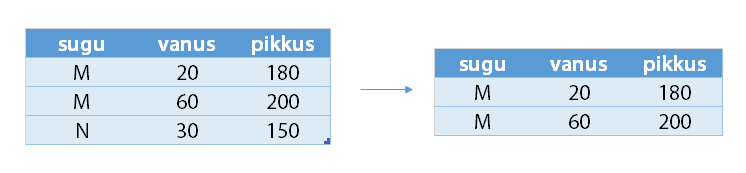
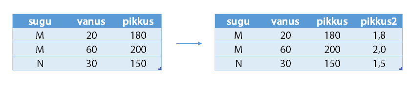
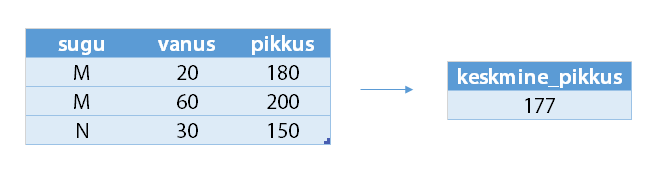
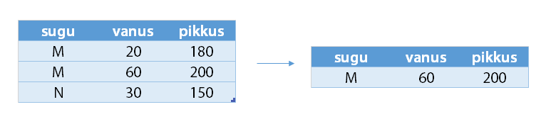

Andmetabelist info kättesaamiseks kasutame R-i paketti *dplyr*. See pakett muudab mugavaks ja kiireks sageli ettetulevad operatsioonid nagu andmestiku filtreerimise, sorteerimise ja grupeerimise. Paketi süntaks omab mitmeidki ühisjooni SQL süntaksi või suuremahuliste andmete töötlemise keelega Pig Latin.

Esmakordsel kasutamisel tuleb pakett installeerida 

```{r, eval=FALSE}
install.packages("dplyr")
```

Kui pakett on installeeritud, tuleb kasutamiseks see laadida käsuga

```{r, eval=FALSE}
library(dplyr)
```


Paketi *dplyr* peamised käsud on:

* `select()`: vali alamhulk veergudest
* `filter()`: vali alamhulk ridadest
* `arrange()`: sorteeri ridu
* `mutate()`: lisa uusi veerge
* `summarise()`: agregeeri mitu väärtust üheks tunnuseks
* `group_by()`: muuda andmestik grupeeritud andmestikuks, et seejärel rakendada funktsioone igale grupile eraldi
* `top_n()`: tipmised tunnused

Nende funktsioonide esimeseks argumendiks on alati *data.frame* ning alati tagastatakse *data.frame*.

Järgnevalt on toodud minimalistlikud näited, mis iseloomustavad paketi *dplyr* funktsionaalsust.

```{r, echo=FALSE, message=FALSE}
library(dplyr)
```

```{r}
andmed = data.frame(sugu = c("M", "M", "N"),
                  vanus = c(20, 60, 30),
                  pikkus = c(180, 200, 150))
andmed
```

### select()
vali alamhulk veergudest


```{r}
# Näide 1
select(andmed, vanus)

# Näide 2
select(andmed, sugu, vanus)

# Näide 3 (annab sama tulemuse, mis näide 2)
select(andmed, -pikkus)

```

### filter()

vali alamhulk ridadest



```{r}
# Näide 1
filter(andmed, pikkus > 160)

# Näide 2
filter(andmed, pikkus > 160, vanus > 30)

# Näide 3 (sama, mis näide 2)
filter(andmed, pikkus > 160 & vanus > 30)
```

### arrange()

sorteeri ridu


```{r}
# Näide 1
arrange(andmed, pikkus)

# Näide 2 (sorteeri kahanevalt)
arrange(andmed, desc(pikkus))
```

### mutate()

lisa uusi veerge



```{r}
# Näide 1
mutate(andmed, pikkus2 = pikkus/100)

# Näide 2 (mitme tunnuse lisamine)
mutate(andmed, pikkus2 = pikkus/100,
       suvaline_tunnus = pikkus*vanus)
```

### summarise()

agregeeri tunnuse väärtused üheks väärtuseks



```{r}
summarise(andmed, keskmine_pikkus = mean(pikkus))
```

### group_by()

muuda andmestik grupeeritud andmestikuks, kus funktsioone rakendatakse eraldi gruppidele


```{r}
andmed_grupeeritult = group_by(andmed, sugu)
# Rakendame funktsiooni summarise iga grupi jaoks eraldi
summarise(andmed_grupeeritult, keskmine_pikkus = mean(pikkus))
# Lisaks keskmisele pikkusele võime ka iga grupi kohta loendada vaatluste arvu
summarise(andmed_grupeeritult, 
          keskmine_pikkus = mean(pikkus), 
          inimeste_arv = n())
```

Sageli muudavad analüüsi kiireks ja mugavaks funktsioonid:

* `distinct()` - eralda unikaalsed väärtused
* `sample_n()` - tõmba n juhuslikku väärtust etteantud veerust
* `n()` - loe kokku andmepunktide arv
* `n_distinct()` - loe kokku unikaalsete väärtuste arv

### top_n()

eralda andmestikust mingi tunnuse järgi TOP n vaatlust (kuid peab arvestama, et tagastatav andmetabel ei ole sorteeritud soovitava tunnuse järgi)

<!-- 
  ### top_n()
  
  tipmised tunnused
  
  
-->

```{r}
# top 1 pikkuse järgi
top_n(andmed, 1, pikkus)
# top 2 pikkuse järgi (näeme, et ei ole sorteeritud)
top_n(andmed, 2, pikkus)
```

### Mitme funktsiooni järjest rakendamine

Näide: Sorteerime pikkuse järgi ning valime välja ainult read, kus sugu == "M"

```{r}
# Variant 1
sorteeritud = arrange(andmed, pikkus)
filter(sorteeritud, sugu == "M")
# Variant 2 (ilma vahetulemust salvestamata)
filter(arrange(andmed, pikkus), 
       sugu == "M")
```

### %>% operaator

Funktsioonide järjest rakendamist võimaldab *dplyr* kirja panna *pipe* operaatori `%>%` abil. 

See operaator võtab vasakul oleva objekti, ning annab selle edasi paremal oleva funktsiooni esimeseks argumendiks. Näiteks `f(x, y)` võime kirjutada `x %>% f(y)`.

```{r}
# Eelneva näite jätk:
# Variant 3, pipe operaatoriga
andmed %>% 
  arrange(pikkus) %>%
  filter(sugu == "M")
```

Eelnevat `%>%` abil kirja pandud koodi võib lugeda järgnevalt

```
Võta andmestik "andmed", seejärel
  sorteeri see pikkuse järgi, seejärel
  eralda sellised read, kus sugu == "M"
```

Nii saadud kood on paremini loetav, eriti kui järjest rakendatakse mitmeid funktsioone. 

Näiteks eelnevalt kirja pandud näite

```{r, eval=FALSE}
andmed_grupeeritult = group_by(andmed, sugu)
summarise(andmed_grupeeritult, keskmine_pikkus = mean(pikkus))
```

saab `%>%` abil kirja panna

```{r, eval=FALSE}
andmed %>%
  group_by(sugu) %>%
  summarise(keskmine_pikkus = mean(pikkus))
```


### Täiendav abimaterjal

Täiendavat informatsiooni *dplyr* funktsionaalsuse kohta leiab:

* [Introduction to dplyr](http://cran.rstudio.com/web/packages/dplyr/vignettes/introduction.html)
* [dplyr dokumentatsioon](http://cran.r-project.org/web/packages/dplyr/dplyr.pdf)