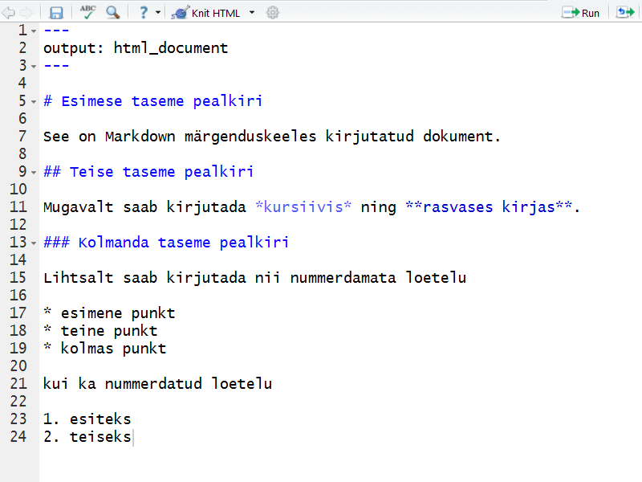
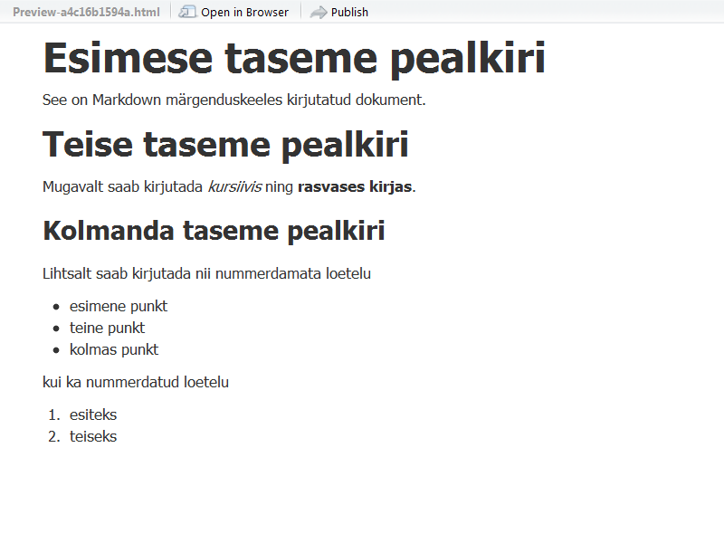
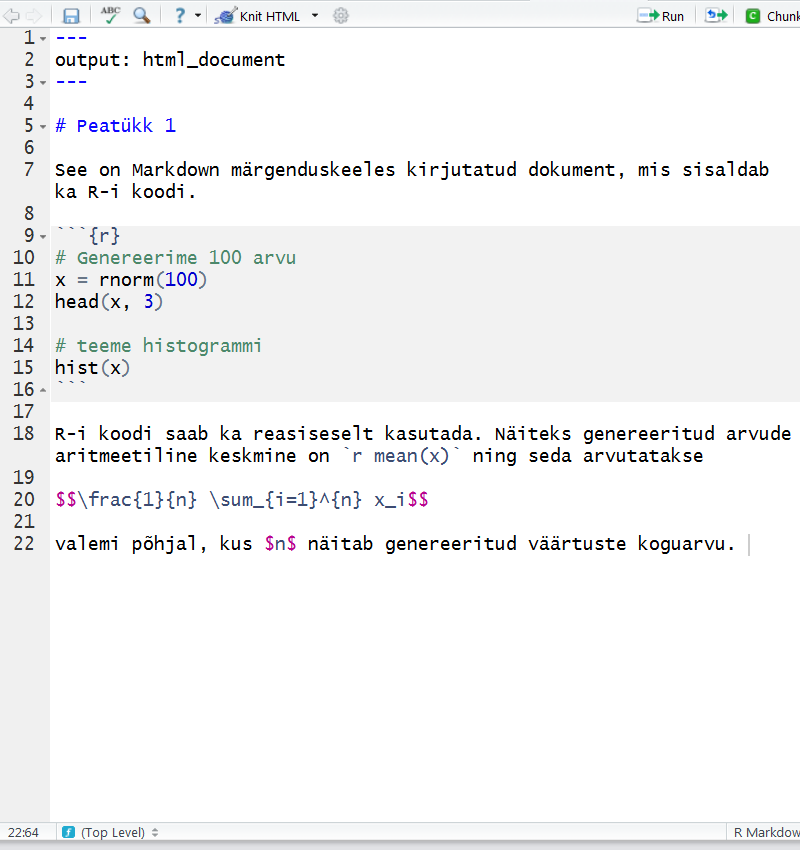
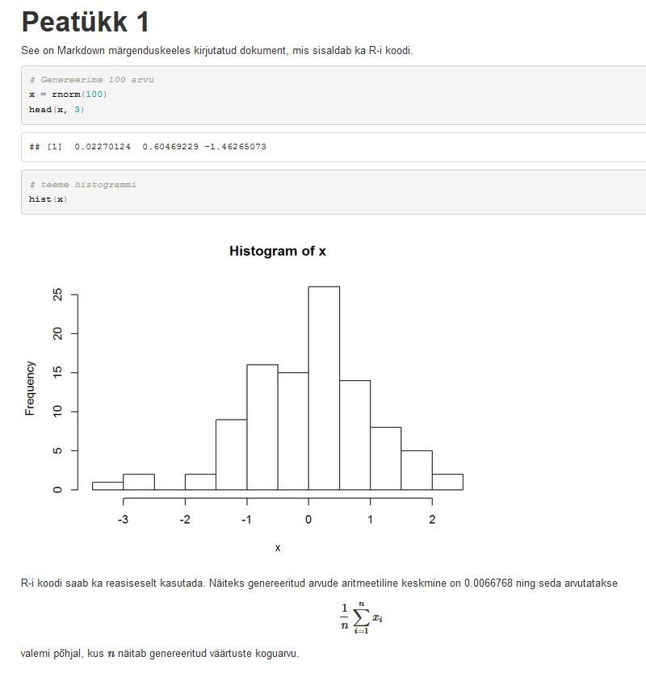

Selles aines hakkame kasutama programmi [RStudio](http://www.rstudio.com/), mis on integreeritud arenduskeskkond (*IDE*) [tarkvara R](http://www.r-project.org/) jaoks. Arvutiklassi arvutitesse on see installeeritud. Kui enda arvutis on RStudio vanem versioon, siis soovitame uuesti installeerida kõige uuem. 

# Raportid paketiga knitr

Pakett  [**knitr**](http://yihui.name/knitr/) võimaldab R-is vähese vaevaga genereerida raporti oma analüüsi kohta. Eriti mugav on seda kasutada RStudio keskkonnas. Esmalt installeerime vajalikud paketid (seda on vaja teha ainult esmakordsel kasutamisel)

```{r, eval=FALSE}
install.packages("knitr")
install.packages("rmarkdown")
```

## R Markdown

Kõige lihtsam on kasutada raporti kirjutamisel märgenduskeelt Markdown. Alustuseks on kõige lihtsam RStudios valida `File -> New File -> R Markdown` ning valida soovitav väljundi formaat (näiteks html). 

Joonisel on kõrvuti näidatud nii Markdown keeles kirjutatud koodi näide kui ka tulemus html-ina. 

### Näide 1

Vasakul **Markdown**, paremal **html**. 

<script src="js/jquery-2.1.3.min.js" type="text/javascript"></script>
<script src="js/jquery.event.move.js" type="text/javascript"></script>
<script src="js/jquery.twentytwenty.js" type="text/javascript"></script>
<link rel="stylesheet" href="css/twentytwenty.css" type="text/css" media="screen" />

<div id="container1">
 <!-- The before image is first -->
 
 <!-- The after image is last -->
 
</div>

<script>
$(window).load(function(){
  $("#container1").twentytwenty();
});
</script>

Kui soovid ise järele proovida, siis allpool on toodud seesama Markdown tekst. Salvesta see tekst `.Rmd` failina RStudios ning seejärel kliki nupul `Knit HTML` või kasutame klahvikombinatsiooni `Ctrl + Shift + K`. 

```{r, eval=FALSE}
---
output: html_document
---

# Esimese taseme pealkiri

See on Markdown märgenduskeeles kirjutatud dokument. 

## Teise taseme pealkiri

Mugavalt saab kirjutada *kursiivis* ning **rasvases kirjas**. 

### Kolmanda taseme pealkiri

Lihtsalt saab kirjutada nii nummerdamata loetelu

* esimene punkt
* teine punkt
* kolmas punkt

kui ka nummerdatud loetelu

1. esiteks
2. teiseks
```

Selle html-i tegemisel kasutas RStudio paketti `rmarkdown`. 

Täpsemalt lugege R Markdowni kohta siit **http://rmarkdown.rstudio.com/**. Näiteks [**R Markdown Basics**](http://rmarkdown.rstudio.com/authoring_basics.html) annab kiire ülevaate Markdown põhilisematest elementidest. 

### Näide 2

Proovime nüüd Markdown teksti vahele ka lisada R-i koodi. Selleks on kõige lihtsam lisada koodiblokk (*code chunk*), mis näeb välja selline
<pre class="markdown"><code>&#96;&#96;&#96;{r}
# siia tuleb kood
&#96;&#96;&#96;
</code></pre>

Koodikasti tekitamiseks on kolm varianti:

* Käsitsi: Vajalikud sümbolid (*backticks*) asuvad klaviatuuril *backspace* klahvi kõrval (tuleb  kasutada koos `shift` klahviga). 
* Klikkides RStudios nupul `Chunks` ja sealt `Insert Chunk`.
* Klahvikombinatsiooniga `Ctrl + Alt + I`. 


Kopeeri nüüd järgnev tekst `.Rmd` faili ning tee sellest html (täpselt sama moodi nagu enne). 

<pre class="markdown"><code>---
output: html_document
---

# Peatükk 1

See on Markdown märgenduskeeles kirjutatud dokument, mis sisaldab ka R-i koodi.

&#96;&#96;&#96;{r}
# Genereerime 100 arvu
x = rnorm(100)
head(x, 3)
# teeme histogrammi
hist(x)
&#96;&#96;&#96;

R-i koodi saab ka reasiseselt kasutada. Näiteks genereeritud arvude aritmeetiline keskmine on &#96;r mean(x)&#96; ning seda arvutatakse
$$\frac{1}{n} \sum_{i=1}^{n} x_i$$
valemi põhjal, kus $n$ näitab genereeritud väärtuste koguarvu. 
</code></pre>

Vasakul **R Markdown**, paremal **html**.

<div id="container2">
 <!-- The before image is first -->
 
 <!-- The after image is last -->
 
</div>

<script>
$(window).load(function(){
  $("#container2").twentytwenty();
});
</script>

Näiteks kui salvestasid lähtekoodi faili `praks1.Rmd`, siis on väljundiks saadud html samas kaustas nimega `praks1.html`. 

### pdf väljund

Juhul, kui soovid html-i asemel saada pdf-i, peab `.Rmd` faili algus olema selline

```{r, eval=FALSE}
---
output: pdf_document
---

```

Pdf-i genereerimisel kasutab knitr TeX-i, seega on vaja, et arvutis oleks installeeritud näiteks MiKTeX. 

Alternatiivselt Markdown keelele saab knitr paketi abil kirjutada ka LaTeXi dokumenti (laiendi `.Rmd` asemel tuleb kasutada siis `.Rnw`), aga sellega me käesolevas kursuses ei tegele. 

### Näpunäiteid

Kui me raportis ei soovi näidata R-i koodi, tuleb koodikasti jaoks spetsifitseerida `echo=FALSE`

<pre class="markdown"><code>&#96;&#96;&#96;{r, echo=FALSE}
x = rnorm(100)
hist(x)
&#96;&#96;&#96;
</code></pre>

Kui soovime raportis näidata R-i koodi, aga ei soovi seda jooksutada, tuleb koodikasti jaoks  spetsifitseerida `eval=FALSE`

<pre class="markdown"><code>&#96;&#96;&#96;{r, eval=FALSE}
x = rnorm(100)
hist(x)
&#96;&#96;&#96;
</code></pre>

Kui soovime mõne tabeli või andmestiku ilusal kujul väljatrükki raportisse, võime kasutada näiteks funktsiooni `kable` paketist `knitr`.

<pre class="markdown"><code>&#96;&#96;&#96;{r}
library(knitr)
data = data.frame(sugu = c("M", "M", "N"),
                  vanus = c(20, 60, 30),
                  pikkus = c(180, 200, 150))
kable(data)
&#96;&#96;&#96;
</code></pre>

```{r, echo=FALSE}
library(knitr)
data = data.frame(sugu = c("M", "M", "N"),
                  vanus = c(20, 60, 30),
                  pikkus = c(180, 200, 150))
kable(data)
```

### Abimaterjal R Markdowni kohta:

* [**R Markdown**](http://rmarkdown.rstudio.com/)
* [**R Markdown Cheat Sheet** pdf](http://www.rstudio.com/wp-content/uploads/2015/01/rmarkdown-cheatsheet.pdf)
