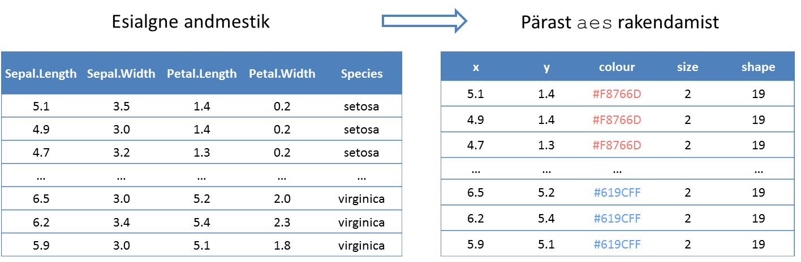

```{r global_options, include=FALSE}
library(knitr)
opts_chunk$set(warning=FALSE, message=FALSE, fig.width=6, fig.height=4)
```

# Mis on ggplot2?

*ggplot2* on populaarne R-i pakett, mis võimaldab suhteliselt vähese vaevaga joonistada ilusaid graafikuid. Kuna joonised on üles ehitatud kiht kihi haaval, on tegu väga paindliku tööriistaga, sest ühel graafikul saab kombineerida erinevaid elemente. 

Suurepärane ülevaate paketi võimalustest annab **ggplot2 dokumentatsioon** <http://docs.ggplot2.org/current/>. 

Ggplot2 autoriks on [Hadley Wickham](http://had.co.nz/). Pakett toetub nn graafikute grammatikale (***Grammar of Graphics***), mille avaldas Leland Wilkinson 2005. aastal. Selle grammatika eesmärk on kirjeldada, mida õieti kujutab endast üks graafik. Nii nagu tavakeeles defineerib grammatika sõnaliigid, mille kombineerimisel saame tekitada suvalisi lauseid, defineerib analoogiliselt graafikute grammatika sellised põhikomponendid, mille kombineerimisel on võimalik tekitada suvalisi graafikuid. Hadley on kirjutanud järgnevat:

> In brief, the grammar tells us that a statistical graphic is a mapping from data to aesthetic attributes (colour, shape, size) of geometric objects (points, lines, bars).

## qplot() ja ggplot() erinevused

Paketis on kaks funktsiooni jooniste tegemiseks, `qplot()` ning `ggplot()`. Järgnev loetelu aitab saada selgust, mis vahe neil funktsioonidel on. 

Funktsioonil `qplot` on mõned eelised võrreldes `ggplot`-iga:

* **Süntaks** võib esialgu tunduda **lihtsam**, kui on varasem kogemus R-i baasgraafikaga, samuti on kood pisut lühem.  
* On võimalik visualiseerida vektoreid, ilma et nad oleks mõne `data.frame`-i veerud. 

Siiski on `qplot`-il ka mitmeid puuduseid võrreldes võimalusterohkema funktsiooniga `ggplot`:

* **Piiratud võimalused**: Ggplot2 paketiga saab erinevate kihtide kombineerimisel teha väga paindlikke jooniseid, aga `qplot` funktsioon võimaldab korraga visualiseerida ainult ühte andmestikku, seejuures peavad kõigil kihtidel olema värv, punktisuurus, kuju jne samasugused. 
* `qplot` süntaks **ei aita aru saada paketi loogikast** (mis põhineb *Grammar of Graphics*-il), milliste kihtide kombineerimisel väljundgraafik loodi. Nii ei teki sügavamat arusaamist, kuidas pakett toimib ning kuidas vajadusel modifitseerida jooniseid. 
* Tegelikult on `qplot` funktsioon sisuliselt *wrapper* `ggplot` jaoks, nii et funktsiooniga `ggplot` saab teha kõike sedasama, mida `qplot`iga, aga `ggplot` on palju paindlikum. 

Kuna funktsioon `ggplot` pakub oluliselt rohkem võimalusi graafikute tegemiseks, kasutame käesolevas kursuses ainult funktsiooni `ggplot`. 


# Joonised funktsiooniga ggplot

```{r, include=FALSE}
library(ggplot2)
```

Joonise tegemiseks tuleb alustada `ggplot` objekti konstrueerimisest. Üks võimalus on seda teha järgnevalt

```{r, eval=FALSE}
library(ggplot2)
ggplot(andmed, aes(x = tunnus1, y = tunnus2))
```

kus esimese argumendina on ette antud andmestik ning teise argumendina *aesthetic mapping*. Seejuures `aes()` argumendid peavad olema ette antud andmestiku veergude nimed.

Praeguseks hetkeks pole veel võimalik joonist vaadata, sest me pole joonisele ühtegi kihti lisanud (st me pole spetsifitseerinud, milliseid elemente sooviksime joonisel näha - antud *x, y* koordinaadid oleks võimalik tähistada nii punktidega, tulpadega, ühendada joontega jne). Näiteks punktide joonistamiseks peaksime lisama joonisele kihi `geom_point()`.

Järgnevalt tutvume ggplot2 võimalustega näidete abil, mis põhinevad iiriste andmestikul

```{r}
# lae andmestik "iris"
data(iris)
# vaatame andmestiku päist
head(iris)
```


## geom_point()

Hajuvusdiagrammi (*scatterplot*) tegemiseks

```{r}
ggplot(iris, aes(x = Sepal.Length, y = Petal.Length)) + geom_point()
```

millele saame ka värvi lisada `colour = tunnuse_nimi` (võime `colour` asemel kasutada ka `color` või `col`)


```{r}
ggplot(iris, aes(x = Sepal.Length, y = Petal.Length, colour = Species)) + geom_point()
```

Märkus: Samasuguse joonise saame ka järgnevate käskude tulemusena
```{r, eval=FALSE}
# Kui soovime iga kihi jaoks kasutada erinevaid tunnuseid x, y koordinaatide jaoks, värvi jaoks jne:
ggplot(iris) + geom_point(aes(x = Sepal.Length, y = Petal.Length, colour = Species))
# Kui soovime iga kihi jaoks kasutada erinevaid andmestikke:
ggplot() + geom_point(data=iris, aes(x = Sepal.Length, y = Petal.Length, colour = Species))

```

#### Mida teeb aes()?

Järgnev skeem selgitab, mida teeb funktsioon `aes()`. Vasakul on näidatud meie esialgne andmestik, paremal selle esitus pärast `aes` rakendamist (*with variables mapped into aesthetic space*). Täpsemalt, 

* *x* koordinaadiks on *Sepal.Length*, 
* *y* koordinaadiks on *Petal.Length*,
* värvi näitab *Species*,

nagu me ise spetsifitseerisime. Kuna punktide kuju ning suuruse kohta me midagi ei öelnud, anti neile vaikimisi väärtused. 



## facet_grid() ja facet_wrap()

Näiteks tunnuse `Species` põhjal saame oma joonise jagada alamjoonisteks (tahkudeks) järgnevalt

```{r}
ggplot(iris, aes(x = Sepal.Length, y = Petal.Length)) + geom_point() + facet_wrap(~ Species)
```

## geom_histogram()

```{r}
ggplot(iris, aes(x = Petal.Length)) + geom_histogram()
# Saame histogrammi tulpasid värvida Species järgi
ggplot(iris, aes(x = Petal.Length, fill=Species)) + geom_histogram()
# Või jagada histogramm tahkudeks Species järgi, üksteise alla
ggplot(iris, aes(x = Petal.Length, fill=Species)) + geom_histogram() + facet_wrap(~ Species, ncol=1)
# Mitteparameetriline tiheduse hinnang
ggplot(iris, aes(x = Petal.Length, fill=Species)) + geom_density(alpha=0.5)
```

## geom_boxplot() ja geom_jitter()

```{r, eval=FALSE}
ggplot(iris, aes(x = Species, y = Petal.Length)) + geom_boxplot()
ggplot(iris, aes(x = Species, y = Petal.Length)) + geom_jitter()
```

```{r}
# informatiivse joonise saame kahe eelneva kihi (boxploti ja punktide) kombineerimisel
ggplot(iris, aes(x = Species, y = Petal.Length)) + geom_boxplot() + geom_jitter()
```


## stat_smooth()

Saame lisada näiteks regressioonisirge iga grupi jaoks

```{r}
ggplot(iris, aes(x = Sepal.Length, y = Petal.Length, colour=Species)) + geom_point() + stat_smooth(method="lm", se=FALSE)
```

