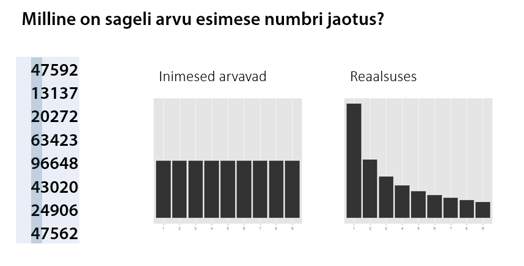

## Sissejuhatus

Markus "Märul" Veekahuri isa on politseinik, ema on politseinik, mõlemad vanaemad on politseinikud ja õde on politseinik.
Algul vaadati viltuselt Markuse soovile ülikooli statistikat õppima minna, kuid pärast kahte kuud vaikimist vahetati telefoni teel esimene "tere" ning lepiti uuesti ära.

Kuid nagu elus ikka, ei kuku käbi kännust kaugele. Markus läks tööle Politsei- ja Piirivalveametisse ning tema igapäevatööks sai pettuste tuvastamine, kasutades statistilisi meetodeid.
Tema ametirelvaks on Benfordi seadus.

Benfordi seadus (sageli nimetatud kui esimese numbri seadus) kirjeldab arvu esimese numbri sagedust. Paljudes reaalsetes andmetes esineb number 1 esinumbrina umbes 30% juhtudest ning iga järgneva numbri sagedus kahaneb monotoonselt.



Empiiriliselt on näidatud, et Benfordi seadus kehtib näiteks aktsiahindade, jõgede pikkuse, riikide rahvaarvu andmetel. Järgneval joonisel on toodud kaks näidet Benfordi seaduse *kehtimisest*.

```{r, include=FALSE}
library(ggplot2)
library(gridExtra)
library(dplyr)
```


```{r, echo=FALSE}
df1 = data.frame(x=factor(c(1:9)),
                y=c(32.62, 16.66, 11.8, 9.26, 7.63, 6.55, 5.76, 5.14, 4.56))
p1 = ggplot(df1, aes(x=x, weight=y)) + geom_bar() + ggtitle("Twitteri kasutajaid jälgijate arvu lõikes \n") +
  scale_x_discrete("Esimene number") + scale_y_continuous("") + theme(text = element_text(size=11))

df1 = data.frame(x=factor(c(1:9)),
                y=c(31.57, 18.12, 11.88, 9.35, 7.84, 6.09, 5.78, 4.83, 4.53))
p2 = ggplot(df1, aes(x=x, weight=y)) + geom_bar() + ggtitle("Riikide SKP suurus \n") + 
  scale_x_discrete("Esimene number") + scale_y_continuous("") + theme(text = element_text(size=11))

grid.arrange(p1, p2, nrow=1)
```

Markuse ametivennad on järeldanud Benfordi seadusest kõrvalekaldumisest, et Kreeka on võltsinud makromajanduslikke näitajaid või et Iraani valimised olid ebaausad. Benfordi seadusest saad täpsemalt lugeda [Vikipeediast.](http://en.wikipedia.org/wiki/Benford%27s_law)

Selles kodutöös on sinu ülesandeks uurida: 

* kas Benfordi seaduse põhjal võib väita, et FIE-d võltsivad maksunäitajaid, 
* kas Benfordi seaduse põhjal võib väita, et 2013. aasta kohaliku omavalitsuse volikogu valimistel toimus pettus.

Kuna ülesannetes on vaja teha *ggplot2* abil jooniseid, soovitame esmalt vaadata ära osa III videod *ggplot2* kohta. 

## Maksude andmestik

Loe sisse Maksu- ja Tolliameti [maksude andmestik](/data/tolliamet_maksud.csv) ja tutvu andmetega. Andmestikus on järgnevad tunnused:

* *registrikood*: juriidilise isiku registrikood
* *nimi*: juriidilise isiku nimi
* *liik*: kas tegemist on äriühingu, MTÜ, FIE vms
* *kaibemaksukohustlane*: kas juriidiline isik on käibemaksukohustlane
* *maakond*: millises maakonnas on juriidiline isik registreeritud
* *riiklikud_maksud*: käibemaks, tollimaks jne
* *toojoumaksud_ja_maksed*: sotsiaalmaks, töötuskindlustusmakse jne

### Ülesanne 1 (2 punkti)

Tee 3 joonist, mis iseloomustavad hästi seda andmestikku.

```{r}
# sinu kood
```

### Ülesanne 2 (2 punkti) 

Kontrolli visuaalselt Benfordi seaduse kehtimist tunnustel *riiklikud_maksud* ja *toojoumaksud_ja_maksed*. Selleks tekita esinumbrite histogramm. Nulliga võrduvad väärtused jäta kõrvale. Tee vastav joonis ka FIE-de, äriühingute jne lõikes (vt tunnus *liik*).

Näpunäide: esimest numbrit aitab eralda näiteks funktsioon `substr`.

```{r}
# sinu kood
```

Kommenteeri tulemusi. 

Kas sellest võib järeldada, et FIE-d jahmerdavad maksudega?


## 2013 KOV valimiste hääletustulemuste andmestik

Loe sisse [andmestik](/data/KOV_valimised_2013.csv) ja tutvu andmetega. Andmestikus on järgnevad tunnused:

* *id*: kandidaadi ID
* *KOV*
* *maakond* 
* *nimekiri* - partei või valimisliit, kuhu kandidaat kuulub
* *partei* - kas Keskerakond, Reformierakond, IRL, SDE või Muu
* *nr* - kandidaadi number
* *haali* - kandidaadi poolt saadud koguhäälte arv (st paberhääled + ehääled)
* *ehaali* - kandidaadi poolt saadud e-häälte arv

### Ülesanne 3 (2 punkti)

Tee 3 joonist, mis iseloomustavad hästi seda andmestikku.

```{r}
# sinu kood
```


```{r, include=FALSE}
data2 = read.table("../../data/KOV_valimised_2013.csv", sep=";", header=T, quote="")
```


### Ülesanne 4 (2 punkti)

Kontrolli visuaalselt Benfordi seaduse kehtimist: 

* e-häälte arvul,
* paberhäälte arvul,
* koguhäälte arvul.

Seejärel tee eelnevad joonised ka erakondade kaupa. Kommenteeri tulemusi.

```{r}
# sinu kood
```


### Ülesanne 5 (3 punkti) 

Tee järgnevale joonisele võimalikult sarnane. 

```{r, echo=FALSE}
levels(data2$partei) = c("KESK", "REF", "IRL", "Muu", "SDE")
ggplot(data2, aes(x=haali, y=ehaali)) + 
  geom_point(data=data2, aes(x=haali, y=ehaali, color=partei, alpha=0.5)) + 
  scale_x_log10() + scale_y_log10() + facet_wrap(~partei) + theme(legend.position="none") +
  scale_color_manual(values=c("#00983A", "#FFDE00", "#009FE3", "#82368C","#E30613"))
```

Näpunäited:

* Log-skaala kasutamiseks uuri [järgmisi ggplot2 näiteid.](http://docs.ggplot2.org/current/scale_continuous.html)
* Legendi peitmiseks uuri [järgmisi ggplot2 näiteid.](http://docs.ggplot2.org/current/theme.html)  (märksõnaks on `legend.position`)
* Et muuta värvid vastavaks erakonna sümboolikaga, kasuta värve "#00983A, #FFDE00, #009FE3, #82368C, #E30613" (vastavalt KESK, REF, IRL, Muu, SDE värvid.)
* Värvide muutmiseks uuri [järgmisi ggplot2 näiteid.](http://docs.ggplot2.org/current/scale_manual.html)


### Boonusülesanne 1 (2 punkti)

Lisa hallid mummud taustale. Tulemus peaks olema selline:

```{r, echo=FALSE}
levels(data2$partei) = c("KESK", "REF", "IRL", "Muu", "SDE")
ggplot(data2, aes(x=haali, y=ehaali)) + 
  geom_point(data = transform(data2, partei = NULL), colour = "grey", alpha=0.5) +
  geom_point(data=data2, aes(x=haali, y=ehaali, color=partei, alpha=0.5)) + 
  scale_x_log10() + scale_y_log10() + facet_wrap(~partei) + theme(legend.position="none") +
  scale_color_manual(values=c("#00983A", "#FFDE00", "#009FE3", "#82368C","#E30613"))

```