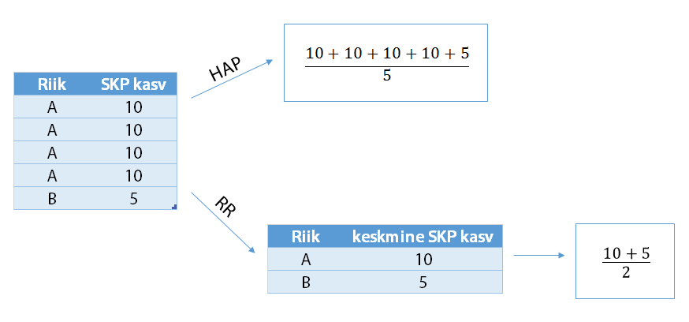
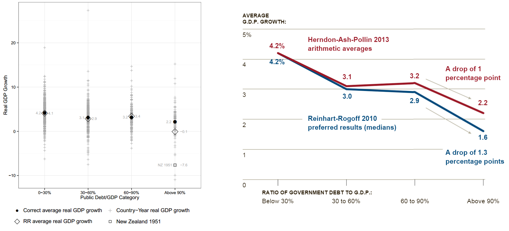
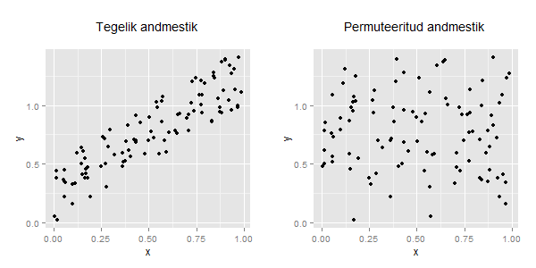
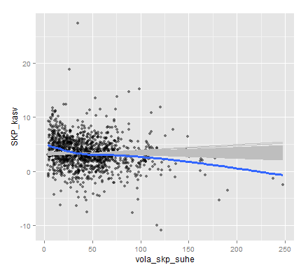

# Sissejuhatus

Kati "Makro" Ökonoomika on tavaline Eesti naine, kes saab kõigega hakkama: ta kasvatab üksi last, maksab koguperelaenu ning töötab Euroopa Komisjoni struktuuriüksuses ametnikuna. 2013. aasta alguses andis Olli Rehn, üks toonastest 28-st Euroopa Komisjoni volinikust, talle ülesandeks uurida võlakoorma mõju majanduskasvule.

Kati teadis, et hea uurimus peab põhinema andmetel mitte ekspertide kõhutundel. Peagi leidis ta artikli *Growth in a Time of Debt*, mille põhitulemuseks oli, et kõrgem riigivõlg on seotud madalama majanduskasvuga ning väga probemaatiline on riigivõlg, mis on üle 90% SKP-st. Artikkel tundus usaldusväärne, sest artikli autoriteks on tunnustatud majandusteadlased Harvardist, artiklit oli tsiteeritud sel hetkel juba üle 500 korra ning see põhines 50-aastasel perioodil.

Juba 9. aprillil 2013 kasutas Olli Rehn oma kõnes Rahvusvahelisele Tööorganisatsioonile Kati leitut:

> public debt in Europe is expected to stabilise only by 2014 and to do so at above 90% of GDP. Serious empirical research has shown that at such high levels, public debt acts as a permanent drag on growth.

Kati tundis, et ta oma tööd hasti teinud ja unistas aastalõpu boonusest. Tema sisemine rahulolu jäi aga üürikeseks. Majandusteadlased (Herndon, Ash, Pollin) ülikoolist UMass Amherst avaldasid teadusartikli, kus väitsid, et Reinhart-Rogoffi metoodikas on tõsiseid vigu sees, alustades Exceli arvutusveast, andmete väljajätmisest ja valest kaalumismeetodist. Majandusteemalised ajalehed olid täis kriitilisi kommentaare, sest Exceli viga on ju hoomatav kõigile.


Moodustati kriisikomisjon, mida pandi juhtima Kati. Vaja on teha suurele hulgale poliitikutele võimalikult lihtsasti selgeks, mille vastu eksisid Reinhart-Rogoff ja kui palju esialgsed tulemused muutusid.

# Tutvumine andmestikuga

20 arenenud riigi kohta on teada SKP kasvunumber ja võlakoorma-SKP suhe aastatel 1946-2009. Andmestikus on järgnevad tunnused:

* *riik*: mis riigi kohta näitajad on toodud
* *aasta*: mis aasta kohta käivad SKP kasv ja võlakoorma-SKP suhe
* *vola_skp_suhe*: võlakoorma ja SKP suhe
* *skp_kasv*: SKP kasvunumber
* *exceli_viga*: binaarne tunnus, mis näitab, kas andmepunkt jäi RR analüüsist välja Exceli *arvutusvea* tõttu (kui on 1, siis jäi välja)
* *valikuline*: binaarne tunnus, mis näitab, kas andmepunkt jäi RR analüüsist välja (HAP väitel selekteerimise tõttu, RR väitel, et neid andmeid analüüsi tegemise ajal polnud. Kui on 1, siis jäi RR analüüsist välja.)

Laadi alla andmestik [skp_ja_volg.csv](/data/skp_ja_volg.csv) ja loe töökeskkonda.

### Ülesanne 1 (2 punkti) - RR ja HAP tulemuste reprodutseerimine

Kontrolli, kas suudad reprodutseerida RR ja HAP tulemused

Juhised: 

* Lisa uus tunnus, mis näitab *vola_skp_suhe* kategooriat (`< 30%`, `30-60%`, `60-90%`, `> 90%`). Näpunäide: kasuks tuleb käsk `cut`.
* kaalumisviisid  
HAP kaalub igas kategoorias andmepunkte võrdselt (ehk võtab tavalise aritmeetilise keskmise), RR arvutab igas grupis riikide keskmise ja võtab neist aritmeetilise keskmise.



* RR-i tulemuste reprodutseerimiseks jäta arvutustest välja andmepunktid, mis jäid välja Exceli vea tõttu (vt tunnus *exceli_viga*) ja andmete puudumise tõttu (vt tunnus *valikuline*).

- RR tegid ka kopeerimisvea: kopeerides riikide keskmisi ühest Exceli tabelist teise, muutus Uus-Meremaa keskmine SKP tõus grupis *"> 90%"* väärtuselt -7.6 väärtuseks -7.9. (Näpunäide: kasuks tuleb käsk `ifelse`.)

```{r}
# sinu kood
```

Peaksid saama sellise tulemuse

```{r, echo=FALSE}
library(knitr)
# mediaanid tabelist 1: http://www.peri.umass.edu/fileadmin/pdf/working_papers/working_papers_301-350/PERI_TechnicalAppendix_April2013.pdf
# keskmised jooniselt 1: http://www.peri.umass.edu/fileadmin/pdf/working_papers/working_papers_301-350/WP322.pdf
df = data.frame(group=c("<30%", "30-60%", "60-90%", ">90%"),
                RR_mean=c(4.1, 2.9, 3.4, -0.1),
                RR_median=c(4.2, 3.0, 3.1, 1.6), # RR_median=c(4.2, 3.0, 2.9, 1.6),
                HAP_mean=c(4.2, 3.1, 3.2, 2.2),
                HAP_median=c(4.1, 3.1, 2.9, 2.3))
kable(df)
```


### Ülesanne 2 (1 punkt) - visualiseeri võlakoormuse muutumist ajas

Visualiseeri, kuidas võlakoorem on aastate jooksul muutunud riikide lõikes

```{r}
# sinu kood
```

# Kuidas efektiivselt visualiseerida ...

Järgnevalt püüame leida parima viisi, kuidas efektiivselt visualiseerida

1. millised vaatlused jäid RR analüüsist välja
2. kuivõrd erinesid RR ja HAP analüüside tulemused
3. kas võlakoormus suurem kui 90% on maagilise tähtsusega (st kas piir on just täpselt 90%)
4. milline on seos SKP ja võlakoormuse vahel

### Ülesanne 3 (1 punkt) - millised vaatlused jäid RR analüüsist välja

```{r}
# sinu kood
```

### Boonusülesanne 1 (2 punkti) - kuidas erinesid RR ja HAP analüüside tulemused

HAPi raportis kasutati vasakpoolset joonist, et visualiseerida RR ja HAP tulemuste erinevusi. NY times pani samale joonisele aga mediaani ja keskmise (parempoolne joonis)! Paku välja parem visualiseerimise idee, kuidas muuta arusaadavaks tulemuste erinevus.



> Praktikumis pakuti välja sarnane joonis NY Times joonisega, aga joondiagrammi asemel kasutame tulpdiagrammi ning mediaanide ja aritmeetiliste keskmiste kohta teeme eraldi joonised. Kuna see meetod nõuab oskusi, mida me ei käsitlenud tunni raames, jääb see ülesanne boonusülesandeks.

Vihje:

```{r, eval=FALSE}
df = data.frame(analyys=c("RR", "RR", "HAP", "HAP"),
                mediaan = c(1, 2, 3, 4),
                grupp=c("30", "60", "30", "60"))

ggplot(df, aes(x=grupp, y=mediaan, fill=analyys)) + 
  geom_bar(position="dodge", stat="identity")
```


```{r}
# sinu kood
```

### Ülesanne 4 (2 punkti) - kas võlakoormus suurem kui 90% on maagilise tähtsusega

> Our main finding is that across both advanced countries and emerging markets, high debt/GDP levels (90 percent and above) are associated with notably lower growth outcomes.

Selgitage välja, kas täpselt 90% on just see piir, millest suurem võlakoormus on seotud madalama SKP kasvuga, või on see suhteliselt suvaliselt valitud arv? 

Üks võimalik lahendusviis: Tekitage uus kategooria, kus võlg jaotatakse 5 gruppi: `< 30%`, `30-60%`, `60-90%`, `90-120%`, `> 120%`). Arvutage iga grupi kohta mediaanid ja keskmised kasutades RR kaalumisviisi.

```{r}
# sinu kood
```

### Ülesanne 5 (4 punkti) - Kuidas visuaalselt uurida, milline on seos SKP ja võlakoormuse vahel?

Kõigepealt, tehke joonis, kus oleks näha seos SKP ja võlakoormuse vahel. Seose iseloomustamiseks võite kasutada `stat_smooth()` abil leitavat joont. 

Näinud seost andmestikus, tekib küsimus, ega see seos ei ole lihtsalt juhuslik. Ehk kas vaadeldud seos erineb oluliselt seostest sellistes andmestikes, kus tegelikult SKP ja võlakoormuse vahel mingisugust seost ei eksisteeri. 

Selle visuaalseks kontrollimiseks võime kasutada järgmist skeemi. See põhineb permutatsioonitestil, mille kohta vaadake esmalt [kodutöö osa III](/praktikum2_kodutoo) videot https://www.youtube.com/watch?v=5Dnw46eC-0o

Skeem:

* Nullhüpotees on, et SKP ja riigivõla vahel seos puudub. 
* Genereerime meie andmetest permuteerimise teel sellise andmestiku, mis vastab nullhüpoteesile. Näiteks võib fikseerida SKP väärtused ning neile vastavusse seatavad riigivõla väärtused permuteerida. (Näpunäide: permuteerimisel on kasuks funktsioon `sample`.) Järgneval joonisel on näidatud tegelik andmestik ning permuteeritud andmestik (permuteeritud andmestik on saadud, kui on fikseeritud x-tunnus, aga y-tunnused on segamini aetud.)



* Leidke eelmises punktis genereeritud andmestikul `stat_smooth` hinnang. 
* Korrake eelnevat näiteks 100 korral ning kandke leitud 100 joont joonisele. Võrdluseks lisage esialgsetel andmetel leitud joon teise värviga. Lõpptulemus võiks tulla sarnane järgmise joonisega:


