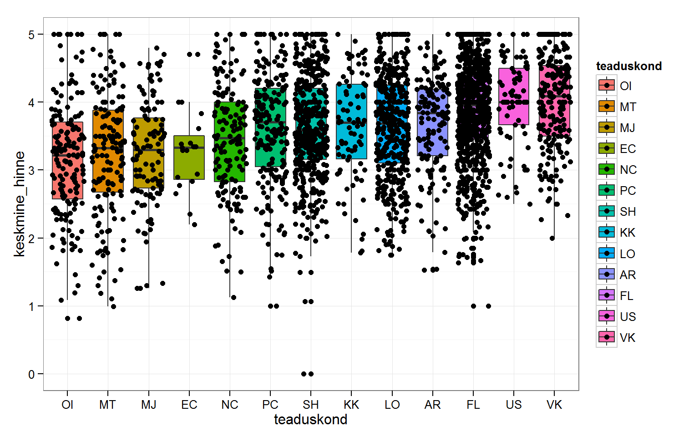
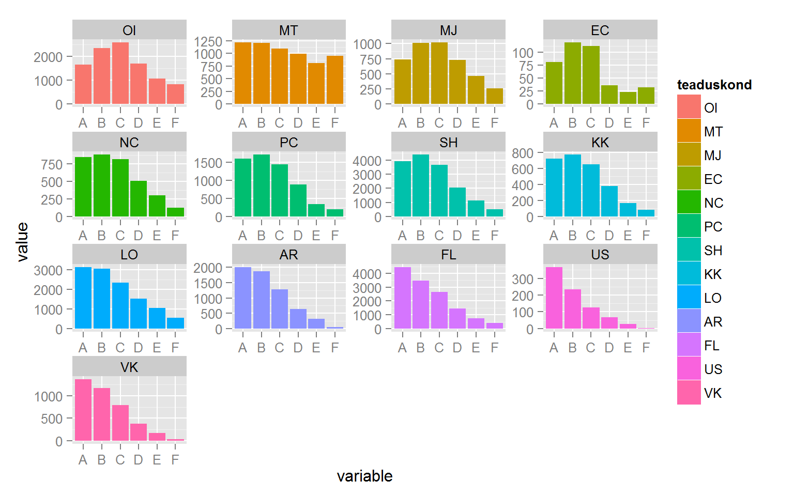
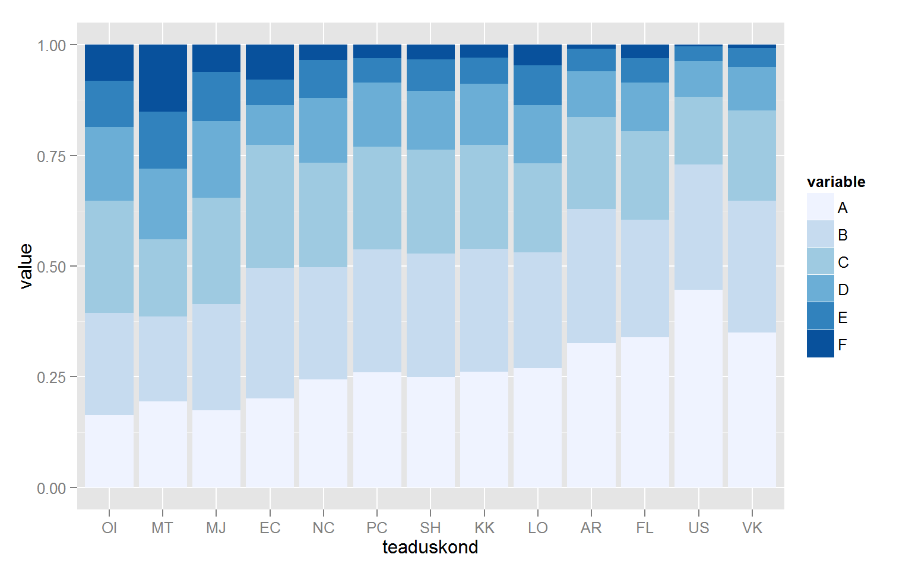
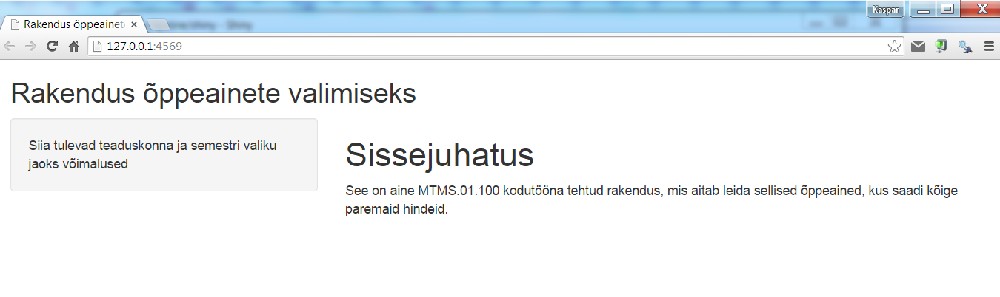
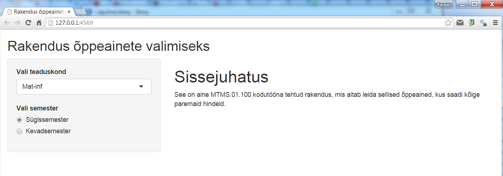
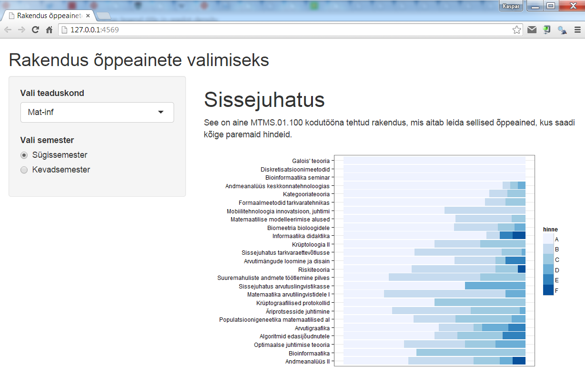

# Kuidas saada vähese vaevaga võimalikult häid hindeid?

### Sissejuhatus

See oli juba kolmas järjestikune öö, mil tudeng Keit "Ogar" Agarilt viis une õudusunenägu. "Te olite võrdsed kandidaadid, kuid parema keskmise hinde tõttu võtsime tööle teise kandidaadi," ütles OÜ Tunnetuslik Homöopaatia personalijuht. Töö sai Keiti alumine naaber, kes õpib 15. sajandi inglise kirjandust. Keit arvab, et seegi unenägu võib olla täideminev ning tal on vaja head vastuargumenti personalijuhile. Äkki on mõnes teaduskonnas kergem paremat hinnet saada, mõtles Keit.

Ta teab, et finantsseisu parandamiseks ei saa lootma jääda vaid tööintervjuule. Mida teeks sellises olukorras tema ületee naaber, kes on saanud mitmeid EL toetusi ja sõidab kullatud istmesoojendusnupuga varustatud Mercedes-Benz maasturiga? Ilmselt uuriks, kuidas võimalikult vähese vaevaga parandada oma keskmist hinnet, et nii stipendiumit saada.

Kuna kolm plaani on ikka parem kui kaks, mõtles Keit, mida võtaks ette tema ettevõtlik tuttav, kes juhib alkoholilaenutuse ettevõtet. Pärast pingsat mõtlemist süttis Keiti peas lambike: ehk teeks ta abistava rakenduse kasvavale tudengipopulatsioonile, kelle eesmärk on võimalikult lihtsalt diplom kätte saada? 

Selles praktikumis uurimegi:

* kas tõesti on mõnes teaduskonnas kergem paremat hinnet saada,
* kas on aineid, milles on märgatavalt kergem paremat hinnet saada,
* kuidas teha veebirakendusi R-is.

### Tutvumine andmestikuga

Laadi ÕISist alla andmestik *UT_13_14_hinded.csv*. Selles andmestikus on 2013/2014 õppeaasta kõigi TÜ õppeainete kohta, mis olid eristava hindamisega, toodud üliõpilaste õppetulemuste jaotus. Lisaks on teada 

* semester (sügis/kevad)
* teaduskond (TÜ struktuuriüksuse lühend)
    * AR  Arstiteaduskond
    * EC	Euroopa kolledž
    * FL	Filosoofiateaduskond
    * KK	Kehakultuuriteaduskond
    * LO	Loodus- ja tehnoloogiateaduskond
    * MJ	Majandusteaduskond
    * MT	Matemaatika-informaatikateaduskond
    * NC	Narva kolledž
    * OI	Õigusteaduskond
    * OO	Õppeosakond
    * PC	Pärnu kolledž
    * SH	Sotsiaal- ja haridusteaduskond
    * US	Usuteaduskond
    * VK	Viljandi kultuuriakadeemia
* aine kood
* aine nimi
* ainele registreerunud üliõpilaste arv
* õppeainele registreerunud üliõpilaste õppetulemuste (A, B, C, D, E, F, mitte ilmunud) jaotus

### Ülesanne 1 (4 punkti)

Kas mõnes teaduskonnas saavad üliõpilased paremaid hindeid kui mõnes teises? Kuidas seda visuaalselt kontrollida? Tee seda. 

> Praktikumis pakuti välja ja tegime järgmised joonised:

### Ülesanne 2 (4 punkti)

Kas mõnes õppeaines saavad üliõpilased paremaid hindeid kui mõnes teises? Millistes ainetes täpsemalt? Visualiseeri. 

<!-- Tee joonis, kus oleks näha parimate hinnetega õppeained (fikseeritud teaduskonna ja semestri korral). -->

Juhised:

* Vali välja sobiv joonisetüüp. 
* Esialgu tegele väiksema andmestikuga, kus teaduskond ja semester oleksid fikseeritud. (Järgmises ülesandes tuleb koodi natuke modifitseerida, et rakenduse kasutaja saaks ise valida teda huvitava teaduskonna ja semestri.)
* Vaatle ainult selliseid aineid, kus oli vähemalt 5 registreerunut. 
* Leia iga õppeaine keskmine hinne. 
* Järjesta õppeained keskmise hinde põhjal. 
* Praegu on õppeaine nimi selline faktor, mille tasemed on tähestikulises järjekorras. Aga ggplot2 joonise jaoks oleks hea, kui see oleks järjestatud keskmise hinde põhjal. (Näpunäide: kasuta funktsiooni `reorder`.)

### Ülesanne 3 (17 punkti) - Rakenduse loomine

Alusta Shiny tutorialiga http://shiny.rstudio.com/tutorial/

1. Tööta läbi *lesson 1*. Juhime tähelepanu järgnevale.
    * Ignoreeri *preview release of RStudio* kommentaari. 
    * Kui sul ei tekkinud nuppu *Run App*, siis sulge RStudio ning ava uuesti. 
    * Pane muuhulgas tähele, et `display.mode = "showcase"` võimaldab keerukamate rakenduste puhul jälgida, millseid koodiridu uuendatakse, kui rakenduse kasutaja parameetreid muudab.  
    * Paralleelselt alusta enda shiny rakenduse loomisega. Selleks tee enda kodutöö jaoks uus kaust ning salvesta sinna `server.R` ja `ui.R` näidisfailid, mida hakkad edaspidi modifitseerima. 
    * Muuda enda rakenduse pealkiri vastavaks selle temaatikale. 
2. Tööta läbi *lesson 2*. Lisa peapaneeli:
      * esimese taseme pealkiri "Sissejuhatus"
      * tavalise tekstina lause, mis kirjeldaks lühidalt rakendust (näpunäide: vastav html termin on *paragraph*). 

Praeguseks võiks sinu rakendus välja näha umbes selline:

3. Tööta läbi *lesson 3*. 
    * Lisa valikukast, mille abil saab rakenduse kasutaja valida teaduskonna. Näita teaduskondade nimesid pikemalt kui vastavad lühendid andmestikus. 
    * Lisa nupp, mille abil saab kasutaja valida, kas teda huvitavad sügis- või kevadsemestri ained.
    
Praeguseks võiks sinu rakendus välja näha umbes selline:

4. Tööta läbi *lesson 4*. Veendumaks, et kõik töötab nii nagu vaja, näita kasutaja valitud väärtuseid. (Näpunäide: funktsioon `textOutput`.)

Praeguseks võiks rakendus välja näha umbes selline:

5. Tutvu *lesson 5*-st muuhulgas [sellega](http://shiny.rstudio.com/tutorial/lesson5/#execution), millist osa `server.R` failist jooksutatakse ainult üks kord ning millist korduvalt. 
    * Lisa oma rakenduse kataloogi kasutatava andmestiku fail (näiteks kas `csv` või `RData` failina).
    * Loe see fail sisse, et kasutada seda rakenduses.
    
6. Lisa nüüd eelmise ülesande tulemusena valminud joonis shiny väljundisse. 

Näpunäide: kui teksti kuvamiseks kasutasid funktsioone `textOutput` ja `renderText`, siis joonise jaoks tuleb kasutada vastavalt funktsioone `plotOutput` ja `renderPlot`. (Kui soovid muuta joonise suurust, selleks on funktsioonil `renderPlot` argumendid `width` ja `height`.)

Muuda joonise tegemise koodi selliselt, et teaduskond ning semester vastaksid kasutaja poolt sisestatud väärtustele. 

Praeguseks võiks rakendus välja näha umbes selline:

Et erinevate teaduskondade joonised oleksid kohakuti (mõnedel ainetel on väga pikad nimed), võid aine nime asemel joonisel näidata aine nime algust (näiteks esimest *n* sümbolit, abiks on funktsioon `substr`). 

### Boonusülesanne 1: Rakenduse täiustamine

Täienda enda rakendust järgnevate lisadega:

* (**1 boonuspunkt**) Lisa slaider, mille abil saab kasutaja valida, mitut TOP ainet ta näha soovib. 
* (**1 boonuspunkt**) Lisa nupp, mille abil saab kasutaja valida, kas teda huvitavad kõige paremate õppetulemustega või hoopis kõige halvemate õppetulemustega ained (neid viimaseid oleks ju vaja vältida). 

Abiks on ka *Shiny Cheat Sheet* pdf, mis on kättesaadav [siit lehelt](http://www.rstudio.com/resources/cheatsheets/)

<!--
Näiteid Shiny rakendustest:

* [BoxPlotR: a web-tool for generation of box plots](http://boxplot.tyerslab.com/). Väärib mainimist, et see rakendus avaldati teadusartiklina ajakirjas [*Nature Methods*](http://www.nature.com/nmeth/journal/v11/n2/full/nmeth.2811.html)
* [ClustVis: a web tool for visualizing clustering of multivariate data](http://biit.cs.ut.ee/clustvis/)
* [R Graph Catalog (ggplot2)](http://shinyapps.stat.ubc.ca/r-graph-catalog/)
-->

### Boonusülesanne 2: Kuidas optimeerida õppeaine tagasisidet?

Õppejõud Peeter "Bijektsioon" Ratsionaalil kästi õppeaine ümber korraldada. Tema õpetatavate ainete tagasiside on siiani olnud kehv, kuid ta on veendunud, et see pole mitte viletsa õpetamise ja halva ainekorralduse tõttu, vaid et üliõpilased annavadki paremat tagasisidet sellistele ainetele, kus eriti midagi tegema ei pea ning kus saab vähese vaevaga häid hindeid. 

Uuri, kas Peetri väited peavad paika. See tähendab, et kas tõepoolest on tal lootust saada ainele paremat tagasisidet, kui selle töömaht on väiksem, kui ette nähtud, ning kui tudengitele panna paremaid hindeid. 

Laadi ÕISist alla andmestik *UT_13_14_tagasiside.csv*. (Praktikumis kasutatud andmestik oli selle alamandmestik.) Siin on toodud 2013/2014 õppeaasta kõigi TÜ õppeainete kohta (st nii eristava kui ka mitteeristava hindamisega):

* semester (sügis/kevad)
* teaduskond (TÜ struktuuriüksuse lühend, samasugused, nagu praktikumis kasutatud andmestikus)
* aine kood
* aine nimi
* ainele registreerunud üliõpilaste arv
* õppeaine töömahtu puudutava tagasiside küsimuse vastuste jaotus
    * tagasiside_1 - aine töömaht oli tunduvalt väiksem
    * tagasiside_2 - aine töömaht oli mõnevõrra väiksem
    * tagasiside_3 - aine töömaht oli selline, nagu ette nähtud
    * tagasiside_4 - aine töömaht oli mõnevõrra suurem
    * tagasiside_5 - aine töömaht oli tunduvalt suurem
* tagasiside küsimuse "Kokkuvõttes hindan antud õppeainet hindega" tulemuste jaotus
    * veerud tagasiside_A, ..., tagasiside_F
* õppeainele registreerunud üliõpilaste õppetulemuste jaotus 
    * eristava hindamisega ainete jaoks veerud hinne_A, ..., hinne_mi
    * mitteeristava hindamisega ainete jaoks veerud hinne_arv, hinne_marv, hinne_mi

Ülesanded:

a. (**3 boonuspunkti**) Uuri, kas õppeainele antud hinne üleüldse sõltub aine töömahust, ning kas ette nähtust väiksem töömaht tagab ainele parema tagasiside skoori. Visualiseeri. 

b. (**3 boonuspunkti**) Uuri, kas õppeainele antud tagasiside üleüldse sõltub tudengite õppetulemustest seal aines, ning milline see sõltuvus on. Visualiseeri. 

