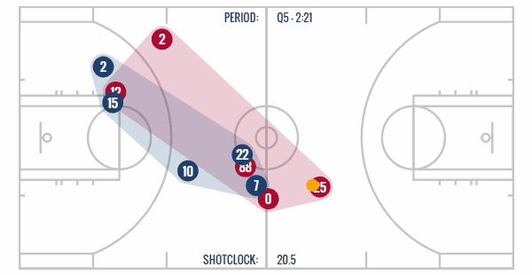
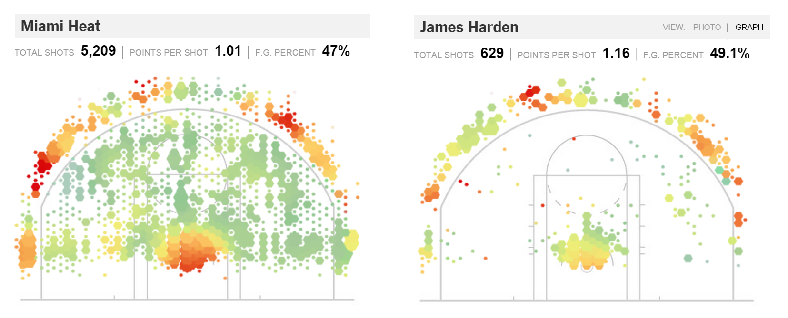
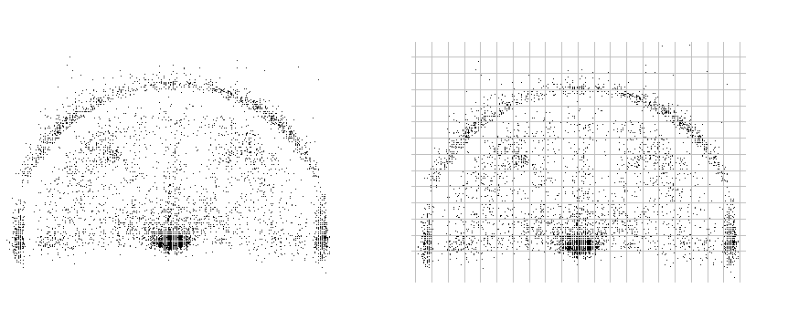
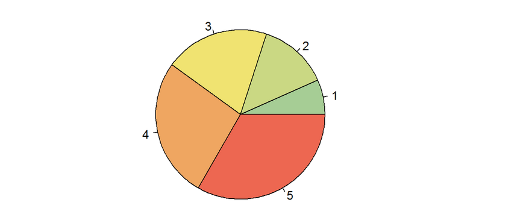
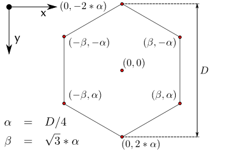

Jaanus "Sops" Kolmene käib jõusaalis kolm korda nädalas. Järgmisel kuul sisustab ta ka reede õhtupooliku raskusi tõstes, sest tema rinnalihas on statistiku jaoks liiga nõrk. Nimelt otsib korvpalliklubi Brooklyn Nets oma ridadesse statistikut, kes analüüsiks korvpalliandmeid ja aitaks seeläbi optimiseerida meeskonna mängustrateegiat. Kandidaadi nõuete seas on ka 50 kg rinnalt surumine. [1](http://brooklynnets.teamworkonline.com/teamwork/jobs/default.cfm)

Kuna rinnalihase nõue on ehk peagi täidetud, tahab Jaanus enne intervjuule minekut saada praktilist kogemust NBA andmete analüüsimisel. Ta teab, et NBA mängude kohta kogutakse SportVU tehnoloogia abil detailset statistikat.



Ta tahab koostada iga mängija ja meeskonna kohta profiili: kust visatakse ning kust tabatakse. Just nagu tegi [NY Times'i graafikaosakond:](http://www.nytimes.com/interactive/2012/06/11/sports/basketball/nba-shot-analysis.html)



Selles praktikumis uurime, kuidas teha sarnast joonist R-i vahenditega.

### Tutvumine andmestikuga

Kasutame NBA 2013/14 hooaja andmeid. Andmestikus on järgnevad tunnused:

* *name* - korvpalluri nimi
* *team_name* - korvpalluri meeskonna nimi
* *opponent* - vastasmeeskonna nimi
* *game_date* - mängu kuupäev
* *shot_made_flag* - kas vise läks korvi
* *shot_type* - kas oli 2-punkti või 3-punkti vise
* *x* - viske x-koordinaat
* *y* - viske y-koordinaat

Laadi alla andmestik [nba_2013.csv](/data/nba_2013.csv) ja loe töökeskkonda.


### Ülesanne 1 (1 punkt)

Visualiseeri NBA meeskonna Miami Heat viskekohti hajuvusdiagrammi abil kasutades tunnuseid *x* ja *y*. Iga sooritatud vise näita täpikesena. Kasuta R-i baasgraafika funktsiooni `plot`.

```{r}
# sinu kood
```

### Ülesanne 2 (2 punkti)

Diskretiseeri mänguväljak (jaga mänguväljak tükkideks). 



Tükid moodusta nii, et ümarda x- ja y-koordinaat kümnelisteni. Iga kastikese kohta arvuta:

* visete arv
* tabavusprotsent

Näpunäide: uuri, mida teeb käsk `round(21:30, -1)`.

```{r}
# sinu kood
```

### Ülesanne 3 (2 punkti)

Visualiseeri eelmise ülesande tulemusena saadud andmeid. Tee kaks joonist:

a.) Iga diskretiseeritud kastikese kohta joonista ring. Ringi pindala olgu proportsionaalne visete arvuga.

b.) Iga diskretiseeritud kastikese kohta joonista ruut. Ruudu pindala olgu proportsionaalne visete arvuga.

Näpunäited: 

* Esmalt tekita tühi aken, kuhu hakkame joonistama: `plot(0, 0, type = "n", xlim=c(-250, 250), ylim=c(0, 400))`
* Ringikesed kanna joonisele funktsiooni `symbols` abil.
* Kuigi `symbols` töötab ka vektoritega, on edasise huvides lihtsam kasutada `for` tsüklit ning kanda ringid/ruudud joonisele ükshaaval.
* Funksiooni `symbols` korral on kasulikud argumendid `inches=FALSE, add=TRUE`. Esimene neist on vajalik selleks, et sümboli suurus skaleeruks vastavalt etteantud raadiusele, `add=TRUE` selleks, et viimati tehtud joonisele lisada uus sümbol.

```{r}
# sinu kood
```

Edasises kasuta omal valikul kas ringe või ruute.

### Ülesanne 4 - suuruse muutmine (2 punkti)

Näeme, et meie joonisel on korvialuste kastikeste pindala palju suurem kui NY Timesi joonisel. NY Timesi graafikaosakond on jaganud visete arvu kolme kategooriasse: low, medium, high. Mida arvad, kas on hea mõte jagada kastid kolme kategooriasse?

a.) Vali välja piirid, mille põhjal jaotatakse visete arv kolme kategooriasse (low, medium, high). Iga kategooria jaoks vali sobiv pindala suurus (kontrolli, et tulemus oleks visuaalselt kena). Kirjuta funktsioon `get_radius`, mis visete arvu sisestamisel tagastab vastava kategooria raadiuse.

```{r, eval=FALSE}
get_radius = function(visete_arv){
  # sinu kood
}
```


b.) Visualiseeri nüüd viskepositsioone sarnaselt eelmisele ülesandele, kui ringidel/ruutudel on vaid 3 erinevat suurust.

```{r}
# sinu kood
```


### Ülesanne 5 - värvid (2 punkti)

Uuri, mida tähistavad [NY Times'i graafikul](http://www.nytimes.com/interactive/2012/06/11/sports/basketball/nba-shot-analysis.html) punane ja roheline värv.

Lisa nüüd ruutudele/ringidele värv vastavalt visketabavusele. Selleks kirjuta esmalt funktsioon `get_color`, mis tagastab antud visketabamusele vastava värvikoodi. 

Näpunäide:

```{r, eval=FALSE}
# defineerime värvigradiendi
pal = colorRampPalette(c("#A6CD95", "#F1E471", "#ED6751"))
# colorRampPalette tagastab funktsiooni, mis võtab sisendiks täisarvu ja väljastab vastava arvu värve
colors = pal(100)
# näide
pie(1:5, col=colors[c(1, 25, 50, 75, 100)])

```



```{r, eval=FALSE}
get_color = function(visketabamus){
  # sinu kood
  
  # tagasta visketabamuste vektorile vastavad värvikoodid
}
```

Tee joonis, kasutades saadud värve.

### Ülesanne 6 - kuusnurgad (2 punkti)

Kasuta nüüd ringide ja ruutude asemel kuusnurki. 

Meeldetuletus kuusnurkadest:



Oleme ette andnud funktsiooni `plot_hexagon`, mis sisestades keskpunkti koordinaadid ja pindala, joonistab kuusnurga.

```{r, fig.height=3}
# funktsioon
plot_hexagon = function(x, y, area, col="red", ...){
  r = sqrt(2*sqrt(3)/9*area)
  x_id = x + c(0, sqrt(3)/2*r, sqrt(3)/2*r, 0, -sqrt(3)/2*r, -sqrt(3)/2*r) 
  y_id = y + c(r, r/2, -r/2, -r, -r/2, r/2)
  polygon(x_id, y_id, col=col, ...)  
}

# näide
plot(0, 0, type = "n", axes = FALSE, xlim=c(-5, 5), 
     ylim=c(-5, 5), xlab="", ylab= "", asp=1)
plot_hexagon(1, 1, 15)
plot_hexagon(3, 3, 15, col="blue", border="white")
```

Tee joonis, kasutades kuusnurki.

```{r}
# sinu kood
```

