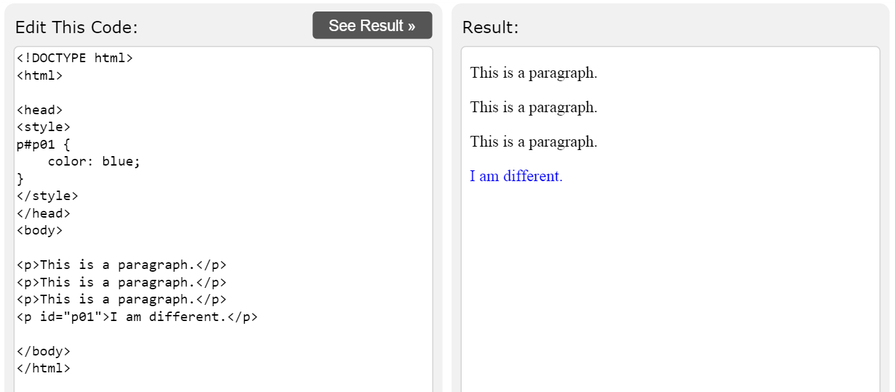
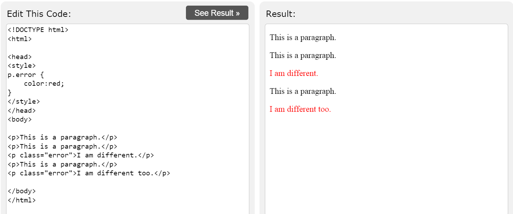
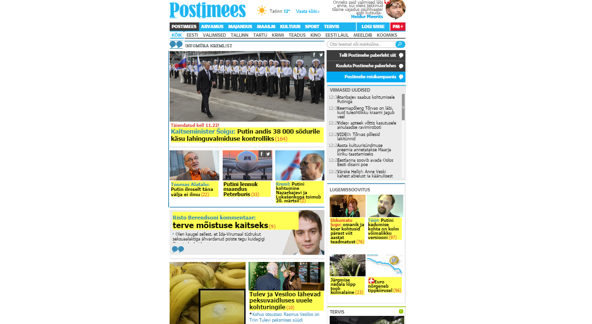

### Sissejuhatus

Eva "Usin" Masin on esimeses praktikumis kohatud Mati "Raha" Masina vastand. Talle meeldib rutiinsus, andmete tuim kopeerimine ja sisestamine. Vabal ajal meeldib talle lugeda romaanisarja "Tõde ja õigus" - eelmine nädal luges ta kokku tähekombinatsiooni "pa" esinemissageduse. Homme pärast tööd jätkab ta "pb" esinemissageduse leidmisega.

Kahjuks oli eelnev tekst fiktsioon ning eva-laadsed kopeerijad surid välja koos neandertaallastega. 
Selles praktikumis vaatame, kuidas R-is ellu äratada tehis-Eva, kes oskab veebilehtedelt automaatselt infot eraldada ja selle transformeerida struktureeritud andmestikuks. 

Täpsemalt, uurime

* kuidas eraldada Riigikogu hääletamistulemusi,
* kuidas eraldada Postimehe uudiste pealkirju,
* kuidas eraldada ilmajaama vaatlusandmeid. 


Kaks esimest ülesannet õpetavad paketi *rvest* funktsionaalsust ja annavad sissejuhatuse veebikraapimisse minimalistlike veebilehtede põhjal.

### Ülesanne 1 (2 punkti) - CSS id

Eralda [html koodis](/examples/html1.html) sinisena olev tekst muutujasse `tekst`. Kasuta paketti *rvest*. 



* Vastava html koodiga saad mängida [siin](http://www.w3schools.com/html/tryit.asp?filename=tryhtml_css_id).

* Loe lühiülevaadet, [millest koosnevad veebilehed](http://andmeteadus.github.io/praktikum5_rvest_minimal).

* Uuri paketi [*rvest* minimalistlikku näidet](http://andmeteadus.github.io/praktikum5_rvest_minimal).

* Uuri paketi [*rvest* dokumentatsiooni](http://cran.r-project.org/web/packages/rvest/rvest.pdf). Kasuks tulevad funktsioonid `html, html_node, html_nodes ja html_text`.

* Lõpptulemuse peaks olema selline: `tekst = c("I am different.")`

```{r}
# sinu kood

```


<!--
```{r, eval=FALSE}
html_source = '<!DOCTYPE html>
<html>

<head>
<style>
p#p01 {
    color: blue;
}
</style>
</head>
<body>

<p>This is a paragraph.</p>
<p>This is a paragraph.</p>
<p>This is a paragraph.</p>
<p id="p01">I am different.</p>

</body>
</html>
'

# sinu kood

print(tekst)
```
-->

### Ülesanne 2 (2 punkti) - CSS class

Eralda [html koodis](/examples/html2.html) punaselt olev tekst muutujasse `tekst`. Kasuta paketti *rvest*. 



* Vastava html koodiga saad mängida [siin](http://www.w3schools.com/html/tryit.asp?filename=tryhtml_css_class).

* Lõpptulemuse peaks olema selline: `tekst = c("I am different.", "I am different too.")`

```{r}
# sinu kood

```


<!--
```{r, eval=FALSE}
html_source = '<!DOCTYPE html>
<html>

<head>
<style>
p.error {
    color:red;
}
</style>
</head>
<body>

<p>This is a paragraph.</p>
<p>This is a paragraph.</p>
<p class="error">I am different.</p>
<p>This is a paragraph.</p>
<p class="error">I am different too.</p>

</body>
</html>'

# sinu kood

print(tekst)
```
-->

### Ülesanne 3 (2 punkti)

Eralda Riigikogu hääletamistulemuste veebilehe [html lähtekoodist](http://www.riigikogu.ee/?op=ems&page=haaletus&hid=a85129ed-4873-4b9d-ac37-4788b6587fa0&), mitu saadikut hääletas kooseluseaduse eelnõu:

* poolt
* vastu
* oli erapooletu
* ei hääletanud

Vihje: Kasutada paketi *tidyr* funktsiooni `extract_numeric()` kui sa ei taha regulaaravaldistega mässata. Vaata näiteks, mida teeb järgmine koodirida `"Kokku: 101 liiget" %>% extract_numeric()`

```{r}
url = "http://www.riigikogu.ee/?op=ems&page=haaletus&hid=a85129ed-4873-4b9d-ac37-4788b6587fa0&"

# sinu kood

```


### Ülesanne 4 (2 punkti)

* Eralda kooseluseaduse eelnõu hääletamistulemuste veebilehe [html lähtekoodist](http://www.riigikogu.ee/?op=ems&page=haaletus&hid=a85129ed-4873-4b9d-ac37-4788b6587fa0&) andmetabel, kus on 101 rida ning tunnused *nr, nimi, otsus, fraktsioon*.

Vihje: kasuta funktsiooni `html_table`

* Kirjuta vastav kood funktsiooniks `extract_table` (seda funktsiooni läheb vaja järgmises ülesandes, kus eraldad kõigi Riigikogu XII hääletuste kohta vastava tabeli). Sisendiks on kas veebilehe url, faili lokaalne asukoht või sõne. Funktsioon peab tagastama vastava data.frame-i (pane tähele, et su funktsioon ei tagastaks listi, milles on üks data.frame). 

```{r}
url = "http://www.riigikogu.ee/?op=ems&page=haaletus&hid=a85129ed-4873-4b9d-ac37-4788b6587fa0&"

extract_table = function(x){
  # sinu kood
}
```

Kontrolli, et funktsioon töötab. 

### Ülesanne 5 (7 punkti) - andmestiku ehitamine

Ülesandes 4 tegid läbi Riigikogu saadikute hääletamistulemuste eraldamise kooseluseaduse korral. Failis [htmls.zip](/data/htmls.zip) on olemas veebilehed kõigi Riigikogu XII hääletuste kohta. Sinu ülesandeks on koostada andmetabel, kus ridades on Riigikogu saadiku nimi ja veergudes kõik hääletamiskorrad. Seda andmestikku läheb vaja järgmises praktikumis, kus uurime hääletamismustreid.

1. Kõigepealt paki lahti zip fail ning loe R-i sisse kõigi html failide nimed.  
Näpunäide: Järgnev kood aitab kätte saada kõigi antud kaustas olevad csv-failide nimed (seejuures argument `full.names` võimaldab tagastada terve failitee).

```{r, eval=FALSE}
filenames = list.files("C:/Users/Kasutaja/andmeteadus/kodutoo5/", pattern = "*.csv", full.names=TRUE)
```

2. Esialgu loe sisse umbes 5 erinevat html faili.  

* NB! Alles siis, kui oled täiesti kindel, et sinu kood töötab korrektselt, võta kasutusele kõik html failid.
* Näpunäide: Järgnev kood loeb sisse kõik muutujas `filenames` olevad `csv` andmestikud ning tekitab neist listi. 

```{r, eval=FALSE}
list_of_dataframes = list()
for(i in 1:length(filenames)){
  temp = read.csv(filenames[i])
  list_of_dataframes[[i]] = temp
}
```

* Praegu pole sul `read.csv` käsuga midagi peale hakata, sest tegeleme html failidega. Kasuta ülesandes 4 kirjutatud funktsiooni `extract_table`.
* Eelneva `for`-tsükli asemel võid kasutada funktsiooni `lapply`. 

3. Lisa igal tsükli sammul andmestikule hääletuse indeks või muu identifikaator. Näiteks `temp$haaletus = i`. 

4. Nüüdseks peaksid olema saanud listi, mille elementideks on erinevad andmetabelid (kõiki faile kasutades peaks nende koguarv olema 1845). Tee nendest andmetabelitest üks suur (pikk) andmetabel, paigutades need üksteise otsa. Seda aitab teha paketi dplyr funktsioon `rbind_all`. Tulemuseks peaksid saama andmetabeli, mille ridade arv on 101 * "sinu kasutatud failide arv". 

5. Muuda pikk andmetabel laiaks. Seda aitab teha paketi reshape2 käsk `dcast`. Uuri funktsiooni `dcast` minimalistlikku näidet [siit](http://andmeteadus.github.io/praktikum3_reshape/#dcast).

6. Kui kõik eelnev töötab, tee eelnev läbi kõikide html failidega. Ära kohku, kui kõikide html tabelite eraldamisega läheb aega 5 minutit või rohkem. 

```{r}
# sinu kood
```

Lõpptulemuseks võiksid saada järgneva andmestiku, kus on 143 rida ning 1846 veergu. 


|Nimi         |1     |2     |3     |4     |...   |1844   |1845   |
|:------------|:-----|:-----|:-----|:-----|:-----|:------|:------|
|Aadu Must    |vastu |poolt |vastu |poolt |... |NA     |NA     |
|Aare Heinvee |poolt |poolt |poolt |poolt |... |poolt  |poolt  |
|Aivar Kokk   |poolt |poolt |poolt |poolt |... |puudub |puudub |


### Ülesanne 6 (3 punkti)

> Eva "Usin" Masin töötab start-upis, mis lubab Eesti turule tuua unikaalse personaalse uudisterakenduse, mis filtreerib uudiseid vastavalt kasutaja soovidele. Eva "Usin" Masin pandi koostama andmebaasi Postimehe esilehe uudiste kohta. Eva teab, kuidas karjääriredelis ülespoole ronida: "Bossi käsu peale olgu uudiste pealkirjad võimalikult kiiresti olemas".

Automatiseeri seesama protsess. Tagasta kõik Postimehe esilehe uudiste pealkirjad (joonisel näidatud kollasega). 

* Ära kurvasta, kui sa ei saa absoluutselt kõiki pealkirju, 97% on praegu piisav.
* Kui sulle ei meeldi Postimehe veebilehe hiiglaslikku lähtekoodi inspekteerida brauseris vaikimisi olevate vahenditega, siis abiks on praktikumis tutvustatud tööriist [selectorgadget](http://selectorgadget.com/).
* Vaata, et sinu tagastatud pealkirjade hulgas poleks tühju sõnesid või arve.



```{r}
url = "http://www.postimees.ee/"

# sinu kood
```

### Ülesanne 7 (3 punkti)

> Eva "Usin" Masinal on suur huvi ilmaandmete vastu. Kümme minutit pärast iga täistundi märgib ta Ilmateenistuse vaatlusandmeid oma märkmikku, et hiljem analüüsi teha.

Automatiseeri seesama protsess. 

Juhised:

* Riigi Ilmateenistus pakub värskeid [ilmaandmeid XML faili kujul](http://www.ilmateenistus.ee/teenused/ilmainfo/eesti-vaatlusandmed-xml/).
* Meie tegeleme [Eesti vaatlusandmete XML failiga](http://www.ilmateenistus.ee/ilma_andmed/xml/observations.php).
* Saa XML failist kätte iga ilmajaama õhurõhk.
* Saa XML failist kätte iga ilmajaama tuule kiirus.
* Tee neist õhurõhu ja tuule kiiruse *scatterplot*.

Näpunäide:

* Uuri paketi [*rvest* minimalistlikku näidet info eraldamisest XML failist](http://andmeteadus.github.io/praktikum5_html_ja_rvest.html#xml).


### Boonusülesanne 1 (2 + 3 punkti) - Viking Loto

> Eva "Usin" Masin on lotohuviline, aga ta pole aastaid Viking Lotoga võitnud. Ta arvab, et lototulemused pole päris juhuslikud ning lotos on võimalik statistiline eelis saada.
Seepärast märgib ta iga lotokolmapäev Viking Loto loositud numbrid üles ja uurib, kas number kahtesid loositakse rohkem välja, kui juhus lubaks.

Õpeta tehis-Eva tegema seda sama.

* Eesti Loto veebilehel on toodud [statistika loositud pallide sagedusest](https://www.eestiloto.ee/osi/stats.do?lastDraws=537&gameCode=11&sort=frq0&action=searchNumbers).
* Eralda vastav tabel, kus veergudes on tunnused *number*, *sagedus* ja *sagedus protsentides*.
* selectorgadget veab sind siin alt ning kergem on lähtekoodi inspekteerida brauseris olevate tööriistadega (Chrome's vajuta `Ctrl + Shift + I`).
* **(3 lisaboonuspunkti)** Uuri, kas on alust arvata, et Viking Loto süsteem on kallutatud.

### Boonusülesanne 2 (kuni 5 punkti) - Kas kõik teed viivad Facebooki? (ehk juhuslik ekslemine veebilehtedel)

Alusta suvaliselt veebilehelt. Eralda kõik väljuvad lingid. Vali üks neist linkidest suvaliselt. Hüppa sellele lingile. Kui sellel leheküljel pole ühtegi väljuvat linki, mine tagasi. Kui väljuvaid linke on mitmeid, vali jälle välja suvaline ja hüppa sinna. Kui jõudsid Facebooki, on katse lõppenud. Korda seda protsessi mitu korda ja erinevate alglehtedega. Uuri, mitmel juhul jõudsid FBsse.

### Boonusülesanne 3 - Facebooki API kasutamine

Kasuta paketti *Rfacebook* ning leia:

**(1 boonuspunkt)** Mis on olnud Tartu Ülikooli Facebooki lehe kõige populaarsem postitus? Mis on olnud matemaatika-informaatikateaduskonna Facebooki lehe kõige populaarsem postitus?

**(5 boonuspunkti :-))** Kasuta R-i, et uuendada oma staatust tekstiga 'Teen aine "Statistiline andmeteadus ja visualiseerimine" kodutööd. Väga põnev! :-)' (kasuks tuleb käsk `updateStatus`).

**(3 boonuspunkti)** Kui sulle ei meeldi Facebooki algoritm, mille põhjal ta postitusi ja pilte uudisvoos järjestab, mõtle välja algoritm, mis selle parandab. Implementeeri selle prototüüp (kasuks tuleb käsk `getNewsfeed`).

Abistavad lingid:

* Kuidas audentida: http://thinktostart.com/analyzing-facebook-with-r/
* Rfacebook dokumentatsioon: http://cran.r-project.org/web/packages/Rfacebook/Rfacebook.pdf