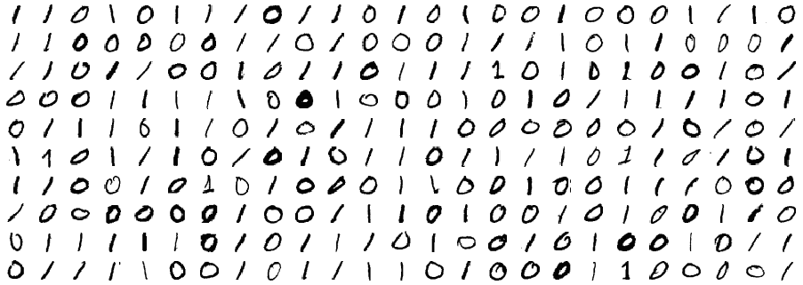
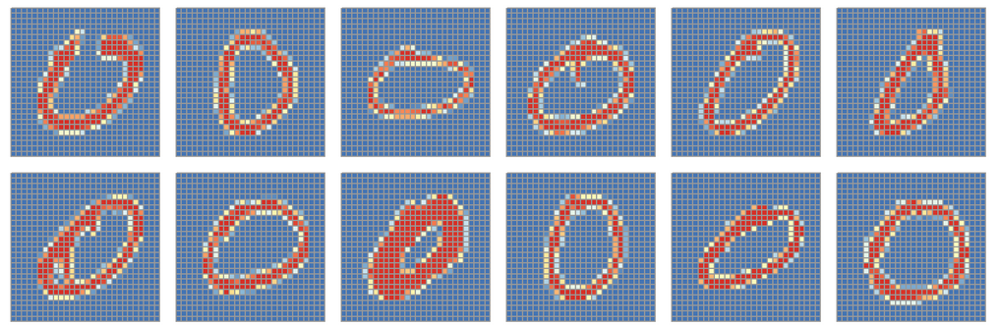
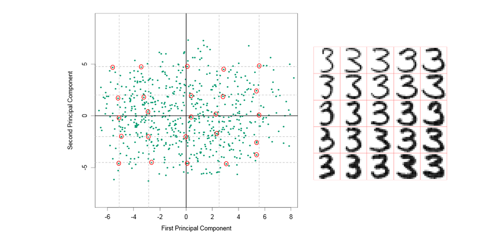
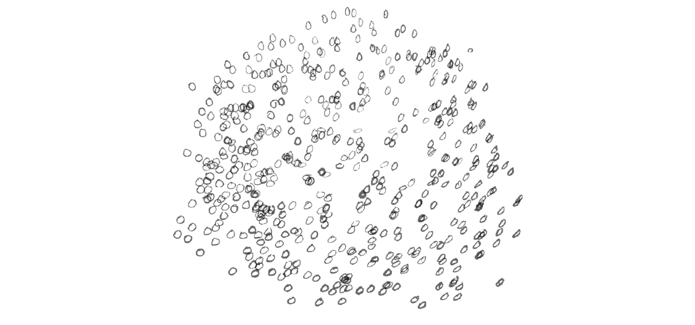

### Sissejuhatus


Andmebaasihaldurile Madis "Select" Baas meeldib süsteemianalüütik Katrin "Süsteemne" Kindlus. Lõuna ajal vahetavad nad salvrätikule kirjutatud binaarkoodis armastuskirju. Täna otsustas Madis Katrinile muljet avaldada ning ehitada automaatse binaarkoodi dekodeerija. Ta sattus aga probleemi otsa - kuidas automaatselt tuvastada, kas käsitsi kirjutatud number on 0 või 1?

Selles praktikumis uurime käsitsi kirjutatud numbrite hingeelu.

### Andmestik

Selleks on meil kasutada andmestik, kus on palju näiteid käsitsi kirjutatud numbritest "0" ja "1". Kõik need näited on 28 x 28 piksli suurused mustvalged pildid. Igale pikslile vastab üks täisarv vahemikus 0, ..., 255, mis näitab antud piksli intensiivsust. Lisaks on kõigi nende näidete kohta teada, millist numbrit on konkreetsel pildil kujutatud. 



Laadi alla andmestik [numbrid.csv](/data/numbrid.csv). Iga rida vastab ühele pildile. Andmestiku viimane veerg *label* näitab, kas tegu on nulli või ühega. Ülejäänud veerud näitavad vastava piksli intensiivsust, kusjuures pikslid on järjestatud ülalt alla (alates vasakust ülemisest nurgast). 

### Ülesanne 1 (2 punkti) - andmestikuga tutvumine

a. Visualiseeri näiteid nii nullide kui ka ühtede seast. 

Näpunäited:

* Abiks on ette antud funktsioon `plot_digit`, mille argumendiks sobib andmestiku üks rida (NB! ilma viimase veeruta)
* Alamjooniste tegemisel on kasuks käsk `par(mfrow = c(mitu_rida, mitu_veergu))`
* Ääriseid saad muuta `par(mar = c(bottom, left, top, right))`

```{r}
plot_digit = function(digit, ...){
  cols = grey(seq(1, 0, length = 256))
  image(t(matrix(as.numeric(digit), nrow=28, ncol=28)[28:1, ]), col = cols, ...)
}

# sinu kood

```

Lisanäpunäide:

* Selleks, et saada esialgsed graafilisi parameetreid tagasi, võid käituda järgmiselt:

```{r, eval=FALSE}
# sinu kood, kus muudad graafilisi parameetreid mfrow ja mar
# Näiteks
par(mfrow=c(2, 5), mar=c(1, 1, 1, 1) + 0.1)

# Pärast taasta esialgsed graafilised parameetrid
par(mfrow=c(1, 1), mar=c(5, 4, 4, 2) + 0.1)
```


b. Tutvu ka paketi *pheatmap* funktsionaalsusega ja visualiseeri nulle ja ühtesid. Abiks on ette antud funktsioon `plot_digit_pheatmap`.

Näiteks nullide korral võiksid joonised välja näha umbes järgnevad. (Aga joonise mitmeks jagamine `mfrow` abil ei tööta siin. Raportisse saad väiksemad pildid, kui muudad koodiploki sätteid `fig.width`, `fig.height`.)



```{r, eval=FALSE}
library(pheatmap)

plot_digit_pheatmap = function(digit){
  mat = matrix(as.numeric(digit), nrow=28, ncol=28)
  pheatmap(mat, cluster_cols=FALSE, cluster_rows=FALSE)
}

# sinu kood
```

c. Sorteeri andmestiku read selliselt, et üleval oleksid nullid ja all ühed. Visualiseeri kogu andmestikku kasutadaes `pheatmap` funktsiooni. Kasuta argumente `cluster_rows=FALSE, cluster_cols=FALSE`. Abiks on [pheatmap minimalistlik näide](/praktikum6_pheatmap_minimal).


```{r}
# sinu kood
```

Küsimus: Miks on punased triibud vaheldumisi sinistega?

Vastus: ...

### Ülesanne 2 (4 punkti)

a. Tee andmestikul PCA (kontrolli, et oled eelnevalt andmestikust eemaldanud tunnuse label). PCA tegemiseks kasuta funktsiooni `prcomp`. Abiks on [PCA minimalistlik näide](/praktikum6_pca_minimal). 

```{r}
# sinu kood
```

Küsimus: Eelmisel korral vaatasid videot, kus näidati, et vahel on andmestiku "efektiivne dimensionaalsus" väiksem kui tunnuste arv. Milline on sinu arvates andmestiku ´efektiivne dimensionaalsus¡ praegusel juhul?

Vastus: ...

b. Tee hajuvusdiagramm PC1 vs PC2. Seejärel märgi joonisele, millised punktid kujutavad numbrit 0 ja millised numbrit 1 (võid kasutada värvi või argumenti `pch`).

```{r}
# sinu kood
```

Küsimus: Mida võiks selle joonise põhjal tähistada PC1?

Vastus: ...

c. Visualiseeri PCA kaalusid.

Näpunäited:

* Peakomponendid on lineaarkombinatsioonid esialgsetest tunnustest. Näiteks $PC1 = \beta_1 * intensiivsus_{\text{esimene_piksel}} + \beta_2 * intensiivsus_{\text{teine_piksel}} + \cdots + \beta_{784} * intensiivsus_{\text{viimane_piksel}}$.
* Tahame visualiseerida PC1 kaalusid $\beta_1, \cdots, \beta_{784}$
* Neid kaale saame visualiseerida sarnaselt numbritele (st 28 x 28 suuruse pildina)

```{r}
# sinu kood
```

Küsimus: Millistel pikslitel on absoluutväärtuselt suured kaalud? Interpreteeri selle abil PC1 tähendust (milliste pikslite intensiivsus peab olema suur ja milliste pikslite intensiivsus madal, et PC1 väärtus oleks võimalikult suur).

Vastus: ...

### Ülesanne 3 (4 punkti)

a. Tee nüüd PCA andmestikul, mis koosneb ainult nullidest. Lisaks tee hajuvusdiagramm PC1 vs PC2.

```{r}
# sinu kood
```

Küsimus: Kas oskad selle joonise põhjal tõlgendada peakomponente PC1 ja PC2?

Vastus: ...

b. Vali üheksa numbrit tasandi erinevatest nurkadest ja visualiseeri neid funktsiooni `plot_digit` abil. (Järgmisel joonisel on tähistatud punasena 25 punkti tasandi erinevatest nurkadest. Paremal pool on näidatud number 3 jaoks võimalik tulemus. Sinul piisab võtta analoogilisest võrestikust 9 punktikest ja visualiseerida neid numbreid.)



Näpunäide: Kasuks võib tulla funktsioon `identify`, mis aitab joonisele vajutades leida lähimad punktid.

```{r}
# sinu kood
```

Küsimus: Kuidas tõlgendad selle joonise põhjal peakomponente PC1 ja PC2?

Vastus: ...

c. Punktikeste asemel visualiseeri numbreid. Lõpptulemus võiks välja näha umbes selline:



Näpunäited:

* Toimi sarnaselt nagu NBA joonise tegemisel.
* Kõigepealt joonista tühi aken.
* `for` tsükli abil lisa numbrid.
* Sul ei ole vaja joonistada kõiki numbreid, sest numbrid võivad kattuda. Võid joonistada näiteks 500 numbrit.

Siin oleme ette andnud täiendatud `plot_digit` funktsiooni, mis muudab valge läbipaistvaks (mis on kasulik, kui numbrid joonistuvad üksteise peale). 


```{r}
plot_digit = function(digit, x=NA, y=NA, scale=1, add=FALSE, transparency=FALSE, ...){
  if(is.na(x)){
    x = 0
  }
  if(is.na(y)){
    y = 0
  }
  
  x_id = seq(x, x + scale, length=28)
  y_id = seq(y, y + scale, length=28)
  
  if(transparency==TRUE){
    tmp = as.character(round(seq(0, 0.99, length=256)*100))
    tmp[nchar(tmp) == 1] = paste("0", tmp[nchar(tmp) == 1], sep="")
    cols = colorRampPalette(c("#FFFFFF", "#000000"))(256)
    cols = paste(cols, tmp, sep="")
  }
  else{
    cols = grey(seq(1, 0, length = 256))
  }
  
  image(x_id, y_id, t(matrix(as.numeric(digit), nrow=28, ncol=28)[28:1, ]),
        col = cols, axes=F, asp=1, add=add, ...)
}


```

Minimaalne näide, kuidas `plot_digit` funktsioni kasutada.

```{r, eval=FALSE}
plot(0, 0, type = "n", xlim=c(0, 10), ylim=c(0, 10), asp=1)

for(i in 1:5){
  x = runif(1, 0, 10) # vaja muuta
  y = runif(1, 0, 10) # vaja muuta
  
  plot_digit(nullid[i, -785], x, y, add=TRUE, transparency = T)
}
```


```{r}
# sinu kood
```

Küsimus: Kuidas tõlgendad selle joonise põhjal peakomponente PC1 ja PC2?

Vastus: ...

d. Tee samasugune joonis nagu eelmises punktis esialgse nullide ja ühtede andmestiku peal.

```{r}
# sinu kood
```

Küsimus: Kuidas tõlgendad selle joonise põhjal peakomponente PC1 ja PC2?

Vastus: ...


### Boonusülesanne 1 (2 punkti) - implementeeri PCA

Selle ülesande eesmärk on implementeerida omaenda PCA. Võid kasutada järgnevat pseudokoodi. 

PCA pseudokood:

1. Tsentreeri andmestik (ehk lahuta igast tunnusest tema keskmine).  
Tähistame tsentreeritud andmemaatriksit $X$ (vaatlused ridades, tunnused veergudes). 

2. Arvuta kovariatsioonimaatriks $X^T X$. (Näpunäide: maatriksite korrutamiseks on R-is operaator `%*%`, transponeerimiseks funktsioon `t()`.)

3. Leia kovariatsioonimaatriksi omaväärtused ja omavektorid. (Näpunäide: Abiks on funktsioon `eigen`)

4. Esimese omavektori elemendid on PC1 kordajad, teise omavektori elemendid PC2 kordajad jne. 
Kasuta nüüd neid kordajaid, et leida kõigi andmepunktide jaoks PC1 ja PC2 väärtus. Selleks tuleb vastavad lineaarkombinatsioonid arvutada kõigi $X$ ridade jaoks. 

> Näiteks kui esimese omavektori elemendid on $\alpha_1, \alpha_2, ..., \alpha_k$, siis PC1 saadakse tsentreeritud tunnuste lineaarkombinatsioonina $PC_1 = \alpha_1 X_{1} + \alpha_2 X_{2} + ... + \alpha_k X_{k}$. Siin $X_1$ tähistab tsentreeritud esimest tunnust, $X_2$ teist jne. 


5. Tagasta PC1 ja PC2 väärtused. 

6. Võrdle minimaalse näite põhjal, kas sinu PCA annab samu tulemusi, mis `prcomp`.


```{r}
# sinu kood
```

### Boonusülesanne 2 (2 punkti) - klassifitseeri numbreid

Paku välja moodus, kuidas pikslite põhjal eristada numbreid 0 ja 1. Leia mitmel juhul sinu meetod prognoosib õigesti, mitmel juhul valesti ja raporteeri täpsus (õigete klassifitseerimiste arv koguarvust). Võiksid täpsuseks saada vähemalt 90%.

```{r}
# sinu kood
```
