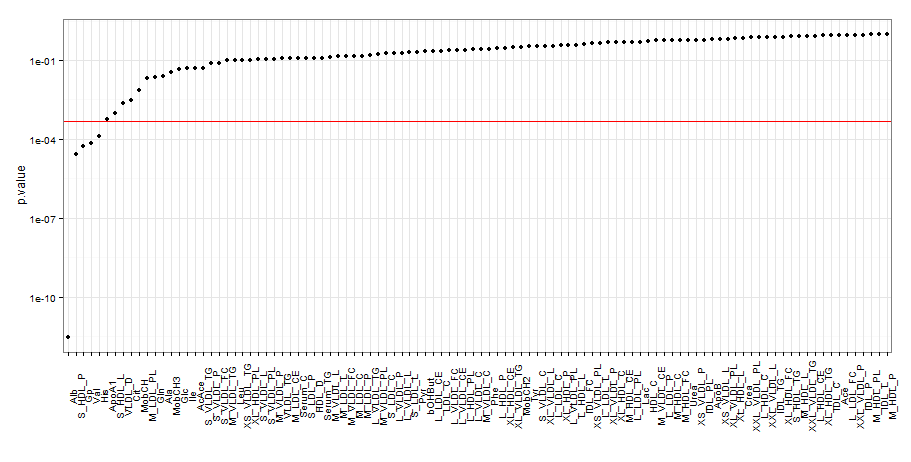

### Sissejuhatus

Geenitehnoloogiat tudeeriv Elo "Elu" Eliksiir on kuulnud, et ka geneetika valdkonnas leidub edukaid ettevõtteid, nagu näiteks 23andMe, mis annab inimesele teada tema riski haigestuda erinevatesse haigustesse. Sestap plaanib ta teha idufirma, mis teeniks tulu inimese surma prognoosimisega. Täpsemalt, inimeselt võetaks vereproov, ning selle tulemuste põhjal öeldaks talle, milline on tema tõenäosus surra järgneva 5 aasta jooksul. 

Et kirjutada taotlus rahastuse saamiseks, on tal esmalt vaja välja mõelda, millel see suremuse test üldse peaks põhinema. See tähendab, et millise ühendi sisaldust vereproovist oleks vaja mõõta? Ta leidis, et Geenivaramu teadlased eesotsas Krista Fischeriga (TÜ statistika vilistlane) on 2014. aastal avaldanud teadusartikli [Biomarker Profiling by Nuclear Magnetic Resonance Spectroscopy for the Prediction of All-Cause Mortality: An Observational Study of 17,345 Persons](http://journals.plos.org/plosmedicine/article?id=10.1371/journal.pmed.1001606). 

Selle praktikumis uurimegi, kas ja kuidas saab biomarkerite abil ennustada surma. Meil on kasutada valim Geenivaramu andmestikust, mis sisaldab 5000 inimese verest mõõdetud 106 biomarkeri väärtuseid. 

Aga mis üleüldse on biomarker?

> A biomarker is a biological molecule found in blood, body fluids, or tissues that may signal an abnormal process, a condition, or a disease. The level of a particular biomarker may indicate a patient's risk of disease, or likely response to a treatment. For example, cholesterol levels are measured to assess the risk of heart disease.

### Andmestik

Kasutame valimit Geenivaramu andmestikust, mida kasutati eelnevalt mainitud teadusartikli juures. Täpsemalt on andmestikus tunnused:

* *sugu*
* *vanusgrupp*
* *s5* - indikaator, kas 5 aasta pärast oli surnud
* *hyp* - kas inimesel on hüpertooniatõbi ehk kõrgvererõhutõbi
* *suits* - kas on suitsetaja
* *LDL_D* - esimese biomarkeri väärtus
* *L_HDL_FC* - teise biomarkeri väärtus
* ...
* *Cit* - viimase biomarkeri väärtus

Laadi ÕISist alla andmestik *biomarkerid.csv* ja loe töökeskkonda.

Analüüsi lihtsuse huvides eemalda puuduvaid andmeid sisaldavad read. Abiks on funktsioon `complete.cases`. 

### Kui hästi on kolesterooli abil võimalik ennustada surma?

> Elo tutvus Geenivaramu andmestikuga, ent seal oli palju arusaamatute lühenditega biomarkereid. Samas on ta kuulnud, et kolesterool on üks nendest näitajatest, mille näit peab tingimata korras olema. Ehk saaks kolesterooli põhjal hästi prognoosida surma?

Eralda andmestikust alamandmestik, mis sisaldaks tunnuseid *sugu*, *vanusgrupp*, *s5*, *hyp*, *suits* ning  järgmisi biomarkereid:

1. Serum_C - üldkolesterool
2. HDL_C - [HDL kolesterool ("hea")](http://en.wikipedia.org/wiki/High-density_lipoprotein)
3. LDL_C - [LDL kolesterool ("halb")](http://en.wikipedia.org/wiki/Low-density_lipoprotein)

### Ülesanne 1 (2 punkti) - kolesterool soo ja vanusegruppide lõikes

Tutvu andmestikuga ja selgita välja, kuidas on kodeeritud tunnus sugu (kas 0 tähistab meest või naist)?

Visualiseeri, kuidas nende 3 biomarkeri jaotused erinevad soo ja vanusegruppide lõikes.

```{r}
#  sinu kood
```

### Ülesanne 2 (4 punkti) - surma prognoosimine kolesterooli abil?

Uuri, kas kolesterool võimaldab prognoosida surma. Selleks tuleb andmetele sobitada mudel. 

a. Visualiseeri, kas kolesterooli (Serum_C, HDL_C, LDL_C) abil võiks saada prognoosida surma.  
b. Tundub, et joonisest ei piisa ning tuleb pöörduda statistiliste mudelite juurde. Kas kasutad lineaarset või logistilist regressiooni? Miks? 
c. Sobitasime mudeli `glm(s5 ~ HDL_C, family=binomial, data=data)` ning selgus, et HDL_C on oluline surma prognoosimisel. Seejärel aga sobitasime mudeli `glm(s5 ~ HDL_C + sugu, family=binomial, data=data)`, siis miskipärast HDL_C enam ei ole oluline. Selgita, mis värk on. Kas siis kokkuvõttes on oluline või mitte?
d. Sobita kolm mudelit, et uurida kolesterooli (tunnuste Serum_C, HDL_C ja LDL_C) seost surmaga. Muide, kas lisad mudelitesse ka tunnused sugu, vanusegrupp, suits ja hyp? Põhjenda oma otsust. 
e. Milline on tulemus, st kas siis mõni kolmest kolesterooli tunnusest on olulise mõjuga surma ennustamisel? 

```{r}
# sinu kood
```

### Kogu andmestikul põhinev analüüs

Eelnimetatud teadusartiklis vaadeldi kõiki 106 biomarkerit. Tegelenud esialgu kolme biomarkeriga, saime tuttavaks logistilise regressiooniga R-is ning julgeme nüüd asuda artiklis kirjeldatud analüüsi reprodutseerima. Kõigis järnevates ülesannetes kasutame kogu andmestikku (st kõiki 106 biomarkerit). 

### Ülesanne 3 (1 punkt) - korrelatsioonid biomarkerite vahel

* Tee joonis, mis annaks hästi edasi, kas ja millised biomarkerid on omavahel korreleeritud. (Näpunäide: Arvuta korrelatsioonimaatriks käsuga `cor` ning visualiseeri seda.) Interpreteeri, milliseid mustreid ja seoseid näed? 

```{r}
#  sinu kood
```


### Ülesanne 4 (1 punkt) - Oluliste biomarkeri tuvastamine

Milline biomarker aitab kõige paremini ennustada surma kui võtame arvesse vanuse ja soo mõju?

Selleks sobita mudelid

* s5 ~ sugu + vanusegrupp + biomarker_1
* s5 ~ sugu + vanusegrupp + biomarker_2
* ...
* s5 ~ sugu + vanusegrupp + biomarker_106

ja iga biomarkeri korral eralda mudelist selle p-väärtus ja kordaja.

Kui sa ei soovi 106 korda glm mudelit käsitsi jooksutada ja manuaalselt p-väärtuseid välja noppida, siis automatiseeri see (näiteks `for` tsükli abil).

Näide, kuidas ühe biomarkeri korral saada kätte p-väärtus ja kordaja:

```{r, eval=FALSE}
biomarker = "LDL_D"
formula0 = "s5 ~ sugu + vanusegrupp"
formula = paste(formula0, biomarker, sep=" + ")
model = glm(formula, family=binomial, data=data)
summary_table = coef(summary(model))
pvalue = summary_table[nrow(summary_table), 4]
estimate = summary_table[nrow(summary_table), 1]

print(paste("Biomarker ", biomarker, 
              ", kordaja: " , estimate,
              ", pväärtus: ", pvalue,
              sep=""))
```


### Ülesanne 5 (1 punkt)

Kirjuta eelnev kood funktsiooniks. Funktsioon võiks välja näha umbes selline:

```{r, eval=FALSE}
estimate_significance = function(formula0, biomarkers, data){
  
  # sinu kood
  
  # võiksid tagastada iga biomarkeri nime, selle p-väärtuse ning kordaja suuruse
  df = data.frame("biomarkers" = ..., "pvalues" = ..., "coefs" = ...)
  return(df)
}
```

Kontrolli oma lahendust:

```{r, eval=FALSE}
f = "s5 ~ sugu + vanusegrupp"
estimate_significance(f, c("LDL_D", "HDL_C"), data)
```

Eelneva koodi jooksutamisel võiksid saada väljundiks:

```{r, echo=FALSE}
data.frame("biomarkers" = c("LDL_D", "HDL_C"), 
           "pvalues" = c(0.00593, 0.073287), 
           "coefs" = c(0.2846, -0.17294))
```

Kasuta nüüd eelnevalt kirjutatud funktsiooni kõigi 106 biomarkeri jaoks. Prindi välja iga biomarkeri p-väärtus ning kordaja hinnang. 

### Ülesanne 6 (1 punkt)

Visualiseeri saadud tulemust. Võid teha näiteks sellise joonise p-väärtustest log-skaalal



### Ülesanne 7 (4 punkti + 1 boonuspunkt) - p-väärtuse piiri paikapanek

Nüüd saime kõigi biomarkerite jaoks teada p-väärtused. Jääb veel küsimus, millised neist peaksime liigitama olulisteks. 

Kuna testisime kõigi 106 biomarkeri olulisust surma ennustamisel, puutume kokku mitmese testimise probleemiga. Vaata selle kohta [koomiksit "Significant"](https://xkcd.com/882/) ning uuri materjalist http://www.stat.berkeley.edu/~mgoldman/Section0402.pdf mitmese testimise ja Bonferroni korrektsiooni kohta. 

(**1 punkt**) Selgita, milles seisnes koomiksi idee. 

(**1 punkt**) Artiklis kasutati olulisuse nivood `p < 0.0005`. Täpsemalt,

> ... significant at the Bonferroni-corrected threshold of p<0.0005, accounting for testing of 106 candidate biomarkers

Selgita, miks kasutati sellist p-väärtuse piiri (aga mitte klassikalist `p < 0.05`)?

(**2 punkti**) Veendumaks, et `p < 0.05` kasutamisel võime tõepoolest saada liiga palju valepositiivseid tulemusi, tekita andmestik, kus puudub seos tunnuse *s5* ja biomarkerite vahel. Selleks tekita uus tunnus, kus oleks *s5* väärtuseid permuteeritud suvaliselt. Sobita nüüd mudelid, kus prognoosiksid permuteeritud *s5* väärtuseid biomarkerite põhjal (selleks võid kasutada ülesandes 5 kirjutatud funktsiooni). 

* Mitme biomarkeri p-väärtused tulid väiksemad kui 0.05? 
* Aga mitu tükki olid olulised Bonferroni korrektsiooni järgi?
* (**1 boonuspunkt**) Korda permuteerimist 100 korral ning tee kokkuvõte tulemustest. 

### Ülesanne 8 (1 punkt) - alternatiiv Bonferroni korrektsioonile

Ülesandes 3 nägime, et mitmed biomarkerid on omavahel tugevalt korreleeritud. Niisiis võib Bonferroni korrektsioon osutuda praegu liiga rangeks. Alternatiivselt võiksime leida, kui suur on meie andmestikus mittekorreleeritud tunnuste arv, ning teha nende arvu järgi Bonferroni korrektsiooni. Selleks, et leida andmestiku nn "efektiivne dimensionaalsus", kasuta PCA-d. 

Juhised:

* Rakenda andmestikul PCA-d ning leia, mitu peakomponenti seletavad näiteks 99\% variatsioonist. 
* Leitud peakomponentide arv näitabki ligikaudu sõltumatute tunnuste arvu meie andmestikus. Tee Bonferroni korrektsioon selle arvu järgi. Millise p-väärtuse piiri saad?

### Boonusülesanne 1 (2 punkti) - usaldusintervallid kordajate jaoks

(**1 boonuspunkt**) Muuda funktsiooni `estimate_significance` selliselt, et iga biomarkeri kordajale arvutad ka 95% usaldusintervalli. Võid kasutada normaaljaotusel põhinevat lähendit ning arvutada selle `kordaja_hinnang +- 1.96 * SE`, kus SE on `summary(model)` väljundis toodud `Std. Error`. Funktsiooni tagastatavas andmetabelis peaksid nüüd olema ka veerud `lower` ja `upper`. 

(**1 boonuspunkt**) Visualiseeri tulemust (näiteks iga biomarkeri kohta näita kordaja hinnangut koos usaldusintervalliga). 

### Ülesanne 9 (1 punkt) - forward selection

Artiklis on kirjeldatud mudeli koostamist järgnevalt: 

> For biomarker discovery in the Estonian Biobank cohort, a multivariate model was derived in a forward stepwise fashion (Figure 2). First, the biomarker leading to the smallest p-value in the model adjusted for age and sex only was included as a predictor. Subsequently, the biomarker leading to the smallest p-value in the multivariate model adjusted for age, sex, and the first biomarker was included in the prediction model. The process was repeated until no additional biomarkers were significant at the Bonferroni-corrected threshold of p<0.0005, accounting for testing of 106 candidate biomarkers.

Eelmistes ülesannetes leidsid kõige olulisema p-väärtusega biomarkeri. Jätka nüüd *forward selection*-iga:

* Lisa leitud biomarker mudelisse ning lähtu mudelist `s5 ~ sugu + vanusegrupp + kõige_olulisem_biomarker`
* Kasuta funktsiooni `estimate_significance` ning leia nüüd järgmine biomarker, mis mudelisse lisada. 
* Jätka senikaua, kuni mudelisse lisatavad biomarkerite p-väärtused on väiksemad kui sinu määratud piir. 

Artiklis saadi sellise protsessi tulemusena 4 olulist biomarkerit: Alb, VLDL_D, Gp, Cit. Kas said samasugused?

### Ülesanne 10 (1 punkt) - surma tõenäosuse prognoosimine

Eelmise ülesande tulemusena on sul nüüd olemas lõplik mudel, mis võtab arvesse kõik, mis on oluline surma tõenäosuse prognoosimiseks. Prognoosi iga andmestikus oleva inimese kohta tema tõenäosust surra 5 aasta jooksul ja visualiseeri tulemust (näiteks histogrammi abil).

Näpunäide: Uuri, mida teeb järgnev kood

```{r, eval=FALSE}
model = glm(s5 ~ suits + HDL_C, family=binomial, data=data)
newdata = data.frame(suits = c(0, 0, 1), 
                     HDL_C = c(0.5, -0.2, 1.1), 
                     suvaline_tunnus = c(1, 2, 3))
# On oluline, et newdata sisaldaks kindlasti kõik need veerud, mida on vaja prognoosimisel
predicted_probabilities = predict(model, newdata=newdata, type = "response")
```


### Boonusülesanne 2 (2 punkti) - prognooside täpsus

Eelmises ülesandes prognoosisid surma tõenäosust. Aga mida hakkab tavainimene peale tõenäosusega? Olgem ikka konkreetsed, kas siis sureb 5 aasta jooksul või mitte. 

Selleks otsusta piir, millisest väiksemad tõenäosused klassifitseerid *ei sure* ja suuremad tõenäosused *sureb*. Kasutades seda piiri ning eelmises ülesandes kirjutatud funktsiooni, arvuta kõigi andmestikus olnud inimeste jaoks 5 aasta jooksul suremise prognoos (justkui meil poleks olnud teada tunnuse s5 väärtus). 

Milline on sinu prognooside täpsus (st kui suur osa prognoosidest langes kokku tunnuse s5 väärtusega)?

Võrdlusmomendi saamiseks paku välja veel mingi teine, naiivne klassifitseerija (see võib põhineda ükskõik kui lihtsal reeglil). Milline on selle täpsus?

