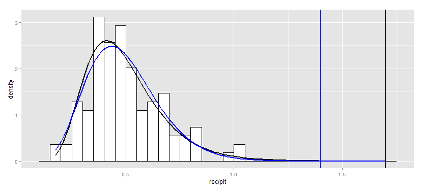
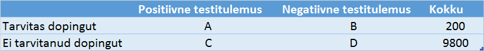

### Sissejuhatus

Sander "Gamma" Lognormaalsele meeldib võistelda. Eelmine nädal käis ta rahvusvahelisel statistikaolümpiaadil, kus ta ei suutnud enamat pronksmedalist. 
Olümpiaadil tuli lahendada mitmeid huvitavaid statistikaülesandeid. Teoreetilises osas oli vaja tuvastada, kas mõni hinnang on nihkega või nihketa. Praktiline osa algas aja peale andmete sisestamisega SASi. Seekord oli praktiline osa eriti põnev, kuna töötati reaalsete andmetega: andmetabelis oli 11 vaatlust ning 2 tunnust. Sellele järgnes osa "Märka olulisi tunnuseid", kus tuli aja peale SASi väljundist üles leida tunnused, mille p-väärtus on väiksem kui 0.05.

Oma tulemusi analüüsides sai Sandrile selgeks, et konkurentidele jäi ta alla viimases, väikeste p-väärtuste märkamise voorus. Ta kahtlustas, et konkurentide paremus tulenes tähelepanu tõstvate ainete manustamisest ning statistikaolümpiaadil tuleks kehtestada dopingutestid. Aga kuidas seda teha? Õnneks leidis ta, et Krista Fischer on tegelenud ühe dopingujuhtumi analüüsimisega, ning on koos Donald A. Berryga kirjutanud artikli [Statisticians Introduce Science to International Doping Agency: The Andrus Veerpalu Case](http://chance.amstat.org/2014/09/doping/). 

Selles praktikumis uurimegi sellesama dopingujuhtumi näitel, kuidas kasvuhormooni dopingutesti piirmäärad seati ning mille vastu eksiti.

### Kasvuhormoonist

Kasvurhormoon on inimkehas toodetud aine, mille ülesanne on reguleerida kehapikkust, lihaste ja organite kasvu. Ravimina on kasutusel sünteetiline kasvuhormoon, mida kasutatakse näiteks laste kasvudefektide ravis ja aidsihaigete üldseisundi parandamiseks. Kuigi teaduslikult pole tõestatud, et sünteetilise kasvuhormooni pruukimine tõstab sportlikke tulemusi (vt [Stanfordi ülikooli teadlaste meta-analüüs](http://annals.org/article.aspx?articleid=741027), mis võtab kokku 27 uuringu tulemused), on spordiringkond siiski arvamusel selle positiivsest mõjust ning 1989. aastal lisas Rahvusvaheline Olümpiakomitee kasvuhormooni keelatud ainete nimistusse.

Sünteetilise kasvuhormooni kasutamist on raske tuvastada. Üks põhjustest on kasvuhormooni kontsentratsiooni suur varieeruvus päeva lõikes ning pulsseeruv sekretsioon.

 põhjal.")

[Saksa teadlaste 2009. aastal väljatöötatud test](http://www.clinchem.org/content/55/3/445.long) ei kontrolligi kasvuhormooni taset, vaid hormooni erinevate molekulitüüpide omavahelist tasakaalu. Eeldatakse, et erinevate isovormide suhe on ajas konstantne. Kuna arvatakse, et sünteetiline kasvuhormooni süstimisel muutub vaid ühe isovormi tase veres. Dopingutesti idee seisnebki testimises, kas kahe isovormi suhe on statistiliselt erinev loomulikust suhtest.

### Andmestik

Laadi ÕISist alla andmestik *doping.csv* ja loe töökeskkonda. Andmestikus on järgmised tunnused:

* *ethnicity* - etnilisus: kas *african* või *caucasian*
* *kit* - dopingutesti erinevad variandid (kit1 ja kit2)
* *rec* - kasvuhormooni isovormi *rec* kontsentratsioon
* *pit* - kasvuhormooni isovormi *pit* kontsentratsioon


### Ülesanne 1 (1 punkt) -  andmetega tutvumine

Lisa andmetabelisse tunnus *ratio*, mis näitab tunnuste *rec* ja *pit* suhet. Visualiseeri tunnuste *rec*, *pit* ja *ratio* jaotusi.

```{r}
# sinu kood
```

### Ülesanne 2 (3 punkti) -  jaotustest

Kodutööna lugesid artiklit [Statisticians Introduce Science to International Doping Agency: The Andrus Veerpalu Case](http://chance.amstat.org/2014/09/doping/). Said teada, et dopingutest põhines kasvuhormooni isovormide suhtel ehk tunnusel *ratio*. Mingi hetk kasutati isovormide suhte modelleerimiseks log-normaalset jaotust, mingil hetkel see enam ei sobinud ning kasutusele võeti gammajaotus. 

a. Aga millised näevad välja log-normaaljaotus ning gammajaotus? Selleks visualiseeri neid.

Näpunäide: Järgnev kood visualiseerib log-normaaljaotuste tihedusi

```{r, eval=FALSE}
library(ggplot2)
library(dplyr)

i = 1
df_list = list()
for(m in c(0, 0.5, 1, 1.5)){
  for(s in c(0.25, 0.5, 1, 2)){
    # tiheduse graafiku jaoks x ja y koordinaadid
    x = seq(0, 5, 0.01)
    y = dlnorm(x, meanlog = m, sdlog = s)
    
    df_list[[i]] = data.frame(x=x, y=y, group = paste("meanlog =", m, ", sdlog =", s))
    i = i + 1
  }
}
df = rbind_all(df_list)
ggplot(df, aes(x, y)) + geom_area() + facet_wrap(~ group) + coord_cartesian(ylim = c(0, 1))

```

Joonista ka gammajaotuse tihedusfunktsioonid $\Gamma(\alpha, \beta)$ erinevate $\alpha \in \{1, 2, 3, 4, 5\}$ ja $\beta \in \{1, 2, 3, 4, 5\}$ jaoks. Selgita, kuidas muutub jaotus, kui muudame kumbagi parameetrit. 


```{r}
# sinu kood
```

b. Tihti eeldatakse statistikas, et tunnus on normaaljaotusega. Kas isovormide suhe võiks põhimõtteliselt olla normaaljaotusega? Põhjenda. 


### WADA metoodika analüüs

Lühikokkuvõte, kuidas määras otsustuspiirid WADA. 

* Analüüsist jäeti välja andmepunktid, kus rec või pit kontsentratsioon oli väiksem kui 0.05.
* Neljale osagrupile (kit1 - valged, kit1 - mustanahalised, kit2 - valged, kit2 - mustanahalised) sobitati parameetriline jaotus.
* WADA väitel sobitus lognormaalne jaotus andmetele kõige paremini.
* Otsustuspiiriks võeti 99.99% log-normaaljaotuse kvantiil.
* Võeti kasutusele mustanahaliste piirmäärad, sest need olid suuremad.


### Ülesanne 3 (2 punkti) - andmete filtreerimine

a. Mis sa arvad, miks jäeti analüüsist välja andmepunktid, kus rec või pit kontsentratsioon oli väiksem kui 0.05?

b. Visualiseeri hajuvusdiagrammi abil, millised andmepunktid jäid analüüsist välja.

```{r}
# sinu kood
```

Edasises kasuta andmestikku, kus rec ja pit on suuremad kui 0.05. 

### Ülesanne 4 (4 punkti) - parameetrilise jaotuse sobitamine

a. [Log-normaaljaotusel](http://en.wikipedia.org/wiki/Log-normal_distribution) on kaks parameetrit. Kuidas leiad sellised parameetrite väärtused, mille korral jaotus sobiks andmetega kõige paremini? Leia need parameetrid "kit1 - valged" osapopulatsiooni jaoks. 

b. Ka [gammajaotusel](http://en.wikipedia.org/wiki/Gamma_distribution) on kaks parameetrit. Kuidas leiad sellised parameetrite väärtused, mille korral jaotus sobiks andmetega kõige paremini? Leia need parameetrid "kit1 - valged" osapopulatsiooni jaoks.

c. Leia kummagi jaotuse 99.99% kvantiil. 

d. Visualiseeri ühel joonisel koos andmetega nii sobitatud log-normaal kui ka gammajaotust. Lisa joonisele 99.99% kvantiil. 

Joonis võiks välja näha umbes selline



### Ülesanne 5 (3 punkti) - kas jaotus sobib andmetega

a. Kas eelnevalt sobitatud log-normaaljaotus võiks sobida andmetega? Mille alusel otsustad?

b. Aga kas gammajaotus võiks sobida andmetega?

c. Oletame, et mõlemad jaotused sobisid andmetega. Mille põhjal langetad otsuse, kumb sobib paremini?

WADA väitis, et log-normaaljaotus sobib andmetele kõige paremini. Kas said sama tulemuse?

### Ülesanne 6 (2 punkti) - valged vs mustanahalised

Valgetele ja mustanahalistele sobitati eraldi parameetriline jaotus. Kas see on vajalik? 

Kuidas testid, kas uuringuandmed annavad põhjust arvata, et mustanahaliste ja valgete *rec/pit* suhe on erinev? Millise tulemuse said? 

```{r}
# sinu kood
```


### Ülesanne 7 (2 punkti) - piirmäärad alamgruppide kaupa

Sobita nüüd kõigile neljale alamgrupile log-normaaljaotus ja leia selle 99.99% kvantiil.

```{r}
# sinu kood
```

Ametlik piirmäär kit1 korral oli 1.81 ja kit2 korral 1.68. Peaksid saama sarnased tulemused.

### Kuidas verifitseeris otsustuspiire WADA?

Esmased otsustuspiirid on määratud. Nüüd tuleb neid verifitseerida. Kuidas tegi seda WADA?

* Rutiinsete dopingukontrollide käigus koguti aastatel 2009-2011 kit1 kohta 3547 mõõtmist ja kit2 kohta 617 mõõtmist.
* Nendes andmetes puudub tunnus *ethnicity*.
* Nüüd filtreeriti välja andmepunktid, kus rec kontsentratsioon oli väiksem kui 0.1 ja pit kontsentratsioon oli väiksem kui 0.05.
* Lognormaaljaotus ei sobinud. Kasutati gammajaotust.
* Visati välja 10 *imelikku* (liiga kõrget) andmepunkti.
* Selle andmestiku põhjal arvutatud kvantiilid tulid väiksemad kui esmase uuringu kvantiilid. Järeldati, et esmased piirmäärad on verifitseeritud.

Laadi ÕISist alla andmestik *doping_verification.csv*. 

### Boonusülesanne (kuni 5 punkti)

Uuri ise midagi põnevat. Näiteks testi, kas tõesti enam log-normaaljaotus ei sobi, või uuri, milline mõju oli *imelike* andmepunktide väljaviskamisel.

### Testi kriitika

> See, kas tegu on gamma- või lognormaaljaotusega on tegelikult mõnes mõttes pseudoprobleem. Tuleb silmas pidada, et me tahame hinnata väga äärmuslikku, 99,99% kvantiili. Kui me valimi põhjal mingi standardse testiga kontrollime parameetrilise jaotuse kehtivust ja jääme nullhüpoteesi juurde, siis see tähendab seda, et suurem osa andmete jaotusest, nn jaotuse "keha" sobib selle jaotuse mudeliga. See test ei ütle midagi jaotuse "saba" kaugema otsa kohta. Ei ole suurt mõtet valideerimisuuringutes näha vaeva sellega, kas algul eeldatud jaotus paika peab. Pigem tuleks näha vaeva sellega, et uurida otsusepiirist üle minevate tulemuste kohta mingitki tausta - kas on vähimatki lisatõendust dopingutarvitamise kohta? Ega ikka muudmoodi ei saagi seda valepositiivse tulemuse tõenäosust kätte. Ja kui see pole võimalik...siis kas saabki kehaomase aine lisadoseerimist täie kindlusega testida?

### Ülesanne 8 (5 punkti) - bootstrap usaldusintervall otsustuspiirile

Testi otsustuspiirid olid määratud vaid 106 sportlase põhjal, kui testiga hakati juba sportlaseid ´vahele võtma¡. Samas eeldati, et test teeb vaid 1 vea 10000 testis. Sellise täpsuse saamiseks oli valimimaht ilmselgelt liiga väike.

Artiklis oli kirjas

> WADA scientists claim that the test with the resulting DL (decision limit) has a specificity of at least 99.99%. The claimed false-positive rate of less than 1 in 10,000 is quite remarkable from a sample size of less than 200! Clearly, it relies strongly on the parametric form of testing results.

Leia bootstrap 95% usaldusintervall dopingutesti piirmäärale (ehk 99.99% kvantiilile). Visualiseeri saadud tulemust. 

[Bootstrap](http://en.wikipedia.org/wiki/Bootstrapping_%28statistics%29) on üks viis leida valimihinnangule (näiteks kvantiilile) usaldusintervall. Kui see on sinu jaoks uus, võid vaadata ühte järgnevatest videotest:

* Vaata Coursera kursuse [Data Analysis and Statistical Inference](https://www.coursera.org/course/statistics) videot (Unit 4 Part 2 - Bootstrapping)
* Alternatiivina vaata Stanfordi Statistical Learning [Bootstrap videot](https://www.youtube.com/watch?v=p4BYWX7PTBM)


### Ülesanne 9 (3 punkti) - valepositiivse testitulemuse tõenäosus

> CASis kohal käinud statistikud (1 Eestist, 1 vägagi nimekas professor USAst) tegid selgeks, et kui test on positiivne, siis dopingutarvitamise tõenäosus jääb vahemikku 10-90%. 90% on õige siis, kui WADA poolt väidetav spetsiifilisus 99,99% (ehk siis valepositiivse tõenäosus 0,01%) kehtib. 10% on õige siis, kui see on tegelikult 99,9%. WADA andmed ei võimalda kindlaks teha, kas ta tegelikult on 99,99% või 99,9%. Sellega oli nõus ka CAS

Kuidas leida, et dopingutarvitamise tõenäosus jääb vahemikku 10-90%, kui sportlane sai positiivse testitulemuse.

Näpunäited:

a. Oletame, et dopingutarvitajaid on 2%, testi tundlikkus on 25%, spetsiifilisus on 99.9% ning oleme testinud 10000 sportlast. Täida nende eelduste põhjal järgmine tabel:



Meeldetuletus:

$$\text{Testi tundlikkus} = \frac{\text{õiged positiivsed}}{\text{õiged positiivsed + valenegatiivsed}}$$

$$\text{Testi spetsiifilisus} = \frac{\text{õiged negatiivsed}}{\text{õiged negatiivsed + valepositiivsed}}$$

Mis on tõenäosus, et positiivse dopingutesti korral on sportlane ka tegelikult dopingut tarvitanud?

b. Oletame nüüd, et testi spetsiifilisus on 99.99%. Mis on tõenäosus, et positiivse dopingutesti korral on sportlane ka tegelikult dopingut tarvitanud?


### Boonusülesanne (3 punkti)

Kasvuhormooni dopingutesti üks eeldustest oli, et isovormide suhe on konstantne.

> Even though the levels of total hGH concentration will vary substantially, it is assumed the ratio between the relevant types of hGH isoforms measured by the test will naturally remain relatively stable.

Mõtle välja viis, kuidas kontrollida eeldust, et testi mõõdetud isovormide suhe on *konstantne* ning ei sõltu tegelikust kasvuhormooni kontsentratsioonist. Kontrolli eeldust kasutades enda väljapakutud lähenemist.
