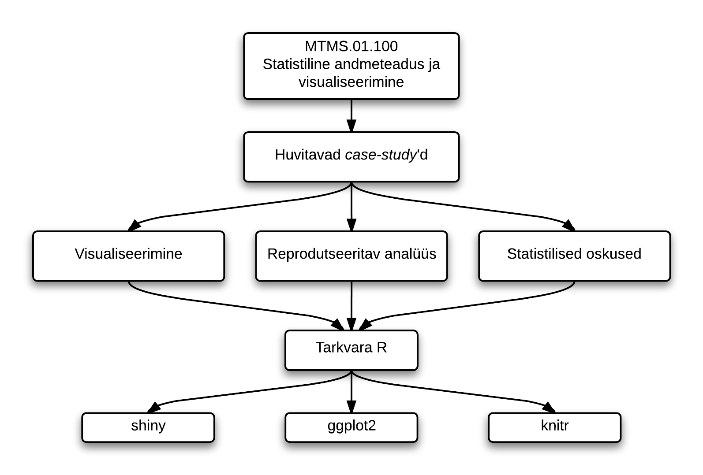

 

### Õppeaine lühikirjeldus

Tegemist on rakendusliku statistikakursusega, kus:

* Probleemipüstitusena kasutatakse huvitavaid päriselulisi andmestikke. 
* Rakendatakse sobivaid statistilisi meetodeid, et püstitatud küsimustele vastust leida. 
* Saadud tulemuste teistele kommunikeerimiseks illustreeritakse neid sobivate joonistega.

Järgnev skeem võtab lühidalt kokku õppeaine olemuse. 

### Õppeaine eesmärgid

* Tutvustada üliõpilastele, milliseid huvitavaid probleeme saab statistika abil lahendada erinevates valdkondades (näiteks bioteadustes, majanduses, juuras), ning harjutada nende lahendamist.
* Õppida visualiseerimismeetodeid andmetest ülevaate saamiseks, tulemuste tõlgendamiseks ja nende sisu edasi andmiseks.
* Tutvustada tarkvara R võimalusi reprodutseeritava analüüsi läbiviimiseks ning tulemuste visualiseerimiseks.

Miks on kursuses olulisel kohal andmeanalüüsi reprodutseeritavus ja visualiseerimine?

* **Reprodutseeritav analüüs:** 

  Kas enamik teadusartiklitest on valed?  

  Teadusajakirjas Nature on olnud palju juttu 
  [reprodutseeritavuse kriisist](http://www.nature.com/nature/focus/reproducibility/index.html): 
  publitseerituid analüüsitulemusi on raske taastekitada. 
  Tihti isegi siis kui kasutatakse samu andmestikke
  (näiteks Harvardi majandusteadlaste [artikkel](http://en.wikipedia.org/wiki/Growth_in_a_Time_of_Debt), 
  mida käsitleme õppeaine raames.)
  
* **Visualiseerimine:**

  Kõige parema ülevaate andmetest saab visualiseerimise abil ning sageli on joonised parimaks viisiks, kuidas statistik saab oma töö tulemusi teistele kommunikeerida. 
  
  > Tähtis on analüüsitulemuste kommunikeerimine ja müümine.  
  > *(Bank of America kvantitatiivne analüütik ja TÜ statistika vilistlane A. Sepp)*

### Sihtgrupp

* Kursus on mõeldud statistikahuvilistele üliõpilastele, kes on tuttavad tarkvaraga R.

  Kui sa ei ole eriti tuttav R-iga, aga soovid seda ainet õppida, siis kirjuta meile ja leiame sulle sobiliku õppematerjali iseseisvaks ettevalmistuseks.

### Õppetöö korraldus

* **Iseseisev töö:** Õppeaines on kasutusel nn pööratud klassiruumi meetod. 
Loengute asemel on ette nähtud iganädalane iseseisev töö. 
See võib sisaldada mõne artikliga tutvumist, veebiloengu vaatamist vms. 
Arutelu iseseisvalt õpitu kohta ning praktikumid toimuvad klassiruumis.
* **Praktikumid:** Aines toimub kokku 9 praktikumi. 
* **Kodutööd:** Praktikumides antakse kokku 8 kodutööd. 
Iga kodutöö tulemuseks on [knitr](http://yihui.name/knitr/)-i raport koos R-i koodi ning kommentaaridega, mis tuleb esitada antud tähtajaks. 
* **Projekt:** Lisaks tuleb läbi viia üks praktiline andmeanalüüs ning kirjutada populaarteaduslikus vormis artikkel saadud tulemustest. 
Artikkel on illustreeritud asjakohaste joonistega ning on arusaadav ka mittestatistikule. 
Projekti võib teha kas üksinda või paaristööna. Tulemusi on vaja esitleda suulisel kaitsmisel.

### Tunniplaan

* Õppeaine toimub 2014/2015. õppeaasta kevadsemestril. 
* Praktikumid **teisipäeviti kell 14.15** ruumis 203  
(nädalatel 24 - 25, 27 - 33). 
* Konsultatsioon esmaspäeviti kell ?? ruumis ???. 

### Kontakt ja küsimused

* Kaspar Märtens
* Tanel Pärnamaa

Meiega saab ühendust aadressil: andmeteadus [at] gmail.com

